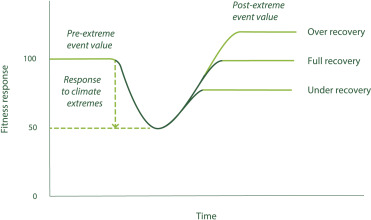

```{r, load_env}
library(deSolve) # for solving ordinary differential equations
library(vegan) # to estimate diversity
library(tidyverse) # for everything
```

# Motivation

As summarized in the introduction of [Logan et al., 2019](https://onlinelibrary.wiley.com/doi/full/10.1111/evo.13862), there's 2 main hypotheses for thermal performance: thermodynamic effect (hereafter called "hotter is better") and specialist-generalist trade-off. The 2 are not mutually exclusive. Both hypotheses describe how the full thermal performance curve of 2 (or more) species are related.

In our experiment, we are **not** interested in the full thermal performance curve. We're only interested in what happens at the very extreme end of temperature. So we can summarize the effect of interest under a null hypothesis and two alternative hypotheses in the following schematics:

```{r, trade_schematic}
plot_muSchematic <- function(fast_ambient, fast_extreme, slo_ambient, slo_extreme,
                             plot_title){
  plot(x=1:2, y=c(fast_ambient, fast_extreme),
       type = "n", xaxt = "n", ylim = c(-1, 2), yaxt = "n",
       xlab = "Temperature", ylab = "Growth rate", main=plot_title)
  # Add custom x-axis labels
  axis(1, at = c(1, 2), labels = c("Ambient", "Extreme"))
  # Draw the two lines
  lines(x=1:2, y=c(fast_ambient, fast_extreme), col="coral", lwd = 2)
  lines(x=1:2, y=c(slo_ambient, slo_extreme), col="darkturquoise", lwd = 2)
}


# make plot for no effect:
plot_muSchematic(slo_ambient = 0.5, slo_extreme = -0.5, fast_ambient = 1.5, fast_extreme = 0.5,
                 plot_title = "Null hypothesis:")

# make plot for Trade-Ups:
plot_muSchematic(slo_ambient = 1.3, slo_extreme = -0.5, fast_ambient = 1.5, fast_extreme = 1,
                 plot_title = "Trade-ups (hotter is better):")

# make plot for Trade-Offs:
plot_muSchematic(slo_ambient = 0.75, slo_extreme = 0.25, fast_ambient = 1.75, fast_extreme = -0.75,
                 plot_title = "Trade-offs:")
```

The question is: how do these different hypotheses map onto Maddy's Resistance-Recovery framework? And what do we expect to see under each of these hypotheses as we increase the duration of the heat pulse event?




Note that when we are talking about resistance and recovery we mean the effect size between the heat pulse treatment versus a no-heat control. More specifically, we are referring to the effect size based on differences between means (e.g., I used the emmeans function `eff_size` in my analysis of the flow cytometry data and this estimates Cohen's d, a standardized mean difference). In the toy models below, everything is fully deterministic and the population is uniform so the populations do not exhibit any variation and we're able to get the mean just from the one simulated value.

# The Model

I think it is sufficient to consider a model of Logistic growth with multiple species $i$, where each species has population size $n_i$: $\frac{1}{n_i} \frac{dn_i}{dt} = \mu_i(T)(1-\frac{\Sigma n_i}{K})$.

Growth rate is an explicit function of temperature ($\mu_i(T)$) but as we have a pulse perturbation, we're actually only interested in two growth rates for each species: that at ambient temperature and at the extreme temperature. The ambient growth rates we have already measured so that's fine. The trouble is that the growth rates are negative for extreme temperatures but we cannot measure death... Anyway we can still eye-ball things.

Finally, we assume that carrying capacity is temperature and species independent. We can estimate the carrying capacity from the control treatment because the temperature stays constant at its ambient value.

For starters, we have just 2 species in the community.

Note that our model does not include extinction (i.e.,the population can approach 0 but it won't ever actually reach it). This should hardly impact the total productivity, except when both species have large negative growth rates during the heat pulse (in which case the effect size of productivity will tend to $\rightarrow -\infty$ instead of plateauing off at some negative fixed value as determined by the no-heat control). I think the lack of extinctions will more often impact the diversity estimate because, even if there is a really big difference in the growth rates between the two species, it's never possible for one to drive the other to extinction. So this means that instead of having diversity reach 0, it will go to small values, thus producing negative values of the effect size that can even $\rightarrow -\infty$ depending on the no-heat control...

---

19 Dec Notes: I think it's worthwhile to simplify the model even further (for now) by considering only exponential growth. That's because we have no antagonistic interactions in the model, it's just competition on density-dependent growth rate. So we can get an idea of how the batch culture results will look like by simulating less time for exponential growth. Then I can more quickly test if my intuition about resistance/recovery make sense before I bother to specify the batch culture model.

16 Jan Notes: Actually I don't think it will work properly without a carrying capacity.
Also: it might be nice to make a little shiny of the simple model just to play around.

26 Jan Notes: After analyzing the toy model, I've decided that the coupling and decoupling framework proposed by Maddy is just not useful for understanding community resilience given how we are defining the effect sizes.

## Building the model

```{r, define_model}
# define the set of ordinary differential equations
ODE_2sp <- function(time, init, params){
  with (as.list(c(time, init, params)), {
    dN1_dt = N1 * mu1 * (1 - (N1 + N2)/K)
    dN2_dt = N2 * mu2 * (1 - (N1 + N2)/K)
    return(list(c(dN1 = dN1_dt, dN2 = dN2_dt)))
  })
}

# a function to simulate the community for a constant temperature
sim_1temp <- function(time, init, params) {
  # solve the system of ODE's for the requested time points:
  sim <- ode(func = ODE_2sp, y = init, parms = params, times = time, method="ode23")
  # make a long data.frame with trees and grass over time
  return(data.frame(sim))
}

# a function to simulate a pulse perturbation
sim_pulse <- function(times, # a vector of length 3: when extreme heat starts, when it stops, and total time
                      mu_ambient, # a named vector of length 2: mu1 and m2
                      mu_extreme, # a named vector of length 2: mu1 and m2
                      K,
                      init # a named vector of length 2: N1 and N2
                      ) {
  # simulate the time at ambient temperature before the start of the heat pulse
  sim <- sim_1temp(time = 0:times[1],
                   init = init,
                   params = c(K=K, mu_ambient["mu1"], mu_ambient["mu2"]))
  
  # then simulate the heat pulse itself and append it to the simulation results
  sim <- rbind(sim[-(times[1]+1),], # remove final value of previous simulation bc it's redundant
               sim_1temp(time = times[1]:times[2], # from beginning to end of heat pulse
                         init = unlist(sim[(times[1]+1),-1]), # initialize from the final values of the previous simulation
                         params = c(K=K, mu_extreme["mu1"], mu_extreme["mu2"])) # use the growth rates during extreme heat
               )
  
  # finally simulate the recovery after heat pulse and append it to the results
  sim <- rbind(sim[-(times[2]+1),],
               sim_1temp(time = times[2]:times[3], # from end of heat pulse to end of time
                         init = unlist(sim[(times[2]+1),-1]),
                         params = c(K=K, mu_ambient["mu1"], mu_ambient["mu2"])) # growth rates at ambient
               )
  
  return(sim)
}

# TO DO: a function to simulate serial transfers with/out pulse perturbations
sim_serialTransf <- function(trmt) {
  # check that trmt has an allowed value
  stopifnot(trmt %in% c("ctrl", "6h", "12h", "24h", "48h"))
  
  # 
}


# a function to get the effect size
heatVScontrol_effect <- function(simdata_heat, # output from sim_pulse
                                 simdata_control # output from sim_1temp for corresponding no-heat control
                                 ) {
  # initialize the data.frame for output
  out_df <- simdata_heat
  
  # get the effect size for each of the 2 species population sizes
  out_df$N1 <- simdata_heat$N1 - simdata_control$N1
  out_df$N2 <- simdata_heat$N2 - simdata_control$N2
  
  # get the effect size on total productivity
  out_df$productivity <- out_df$N1 + out_df$N2
  
  # get the effect size on Shannon diversity
  div_heat <- diversity(simdata_heat[,-1], index = "shannon")
  div_control <- diversity(simdata_control[,-1], index = "shannon")
  out_df$diversity <- div_heat - div_control
  
  return(out_df)
}

##################################################

# let's try out an example
State <- c(N1=0.001, N2=0.001)
heat_pulse_times <- c(5,18,30)
carrying_cap <- 10^6
sp1_ambient <- 0.99
sp1_extreme <- 0.46
sp2_ambient <- 0.81
sp2_extreme <- 0.75

plot_muSchematic(fast_ambient = sp1_ambient, fast_extreme = sp1_extreme,
                 slo_ambient = sp2_ambient, slo_extreme = sp2_extreme,
                 plot_title = "Trade-off example")

# simulate the community with heat pulse
simEX <- sim_pulse(times=heat_pulse_times, init=State, K=carrying_cap,
                   mu_ambient=c(mu1=sp1_ambient, mu2=sp2_ambient), mu_extreme=c(mu1=sp1_extreme, mu2=sp2_extreme))

# plot the example under heat pulse conditions
ggplot(pivot_longer(simEX, cols = N1:N2),
       aes(x=time, y=value, colour=name)) +
  geom_line() +
  labs(title = "Heat pulse from 5 to 18 time units", y="Population size", colour = "Species") +
  scale_y_log10()

# simulate the community WITHOUT heat pulse (i.e., no heat control)
simCTRL <- sim_1temp(time = 0:heat_pulse_times[3],
                   init = State,
                   params = c(K=carrying_cap, mu1=sp1_ambient, mu2=sp2_ambient))
# plot the no heat control:
ggplot(pivot_longer(simCTRL, cols = N1:N2),
       aes(x=time, y=value, colour=name)) +
  geom_line() +
  labs(title = "No heat pulse", y="Population size", colour = "Species") +
  scale_y_log10()

# put the 2 treatments on the same plot
temp.df <- rbind(data.frame(pivot_longer(simEX, cols = N1:N2), trmt="heat"),
                 data.frame(pivot_longer(simCTRL, cols = N1:N2), trmt="control"))
ggplot(temp.df,
       aes(x=time, y=value, group=paste(trmt, name))) +
  geom_rect(aes(xmin=5, xmax=18, ymin=0, ymax=Inf), fill="cornsilk") +
  geom_line(aes(linetype=trmt, colour=name)) +
  scale_y_log10() +
  labs(linetype="Treatment", colour="Species",
       y="Population size") +
  theme_classic()

# put the total productivity both treatments on the same plot
temp.df <- rbind(data.frame(simEX %>% mutate(productivity = N1+N2, .keep="unused"),
                            trmt="heat"),
                 data.frame(simCTRL %>% mutate(productivity = N1+N2, .keep="unused"),
                            trmt="control"))
ggplot(temp.df,
       aes(x=time, y=productivity, group=trmt)) +
  geom_rect(aes(xmin=5, xmax=18, ymin=0, ymax=Inf), fill="cornsilk") +
  geom_line(aes(linetype=trmt)) +
  scale_y_log10() +
  labs(linetype="Treatment",
       y="Total productivity") +
  theme_classic()

# finally, put the diversity both treatments on the same plot
temp.df <- rbind(data.frame(time = simEX$time,
                            div = diversity(simEX[,-1], index="shannon"),
                            trmt="heat"),
                 data.frame(time = simCTRL$time,
                            div = diversity(simCTRL[,-1], index="shannon"),
                            trmt="control"))
ggplot(temp.df,
       aes(x=time, y=div, group=trmt)) +
  geom_rect(aes(xmin=5, xmax=18, ymin=0, ymax=Inf), fill="cornsilk") +
  geom_line(aes(linetype=trmt)) +
  labs(linetype="Treatment",
       y="Shannon Diversity") +
  theme_classic()
rm(temp.df)

################ let's look at the effect size in different ways:
effects_df <- heatVScontrol_effect(simdata_heat=simEX, simdata_control=simCTRL)

# plot per species
ggplot(effects_df %>%
         select(time, N1, N2) %>% pivot_longer(cols = N1:N2),
       aes(x=time, y=value, colour=name)) +
  geom_line() +
  labs(title = "Effect size on each species (pulse - control)", y="Change in population size", colour = "Species")

# total productivity
ggplot(effects_df %>%
         select(time, productivity),
       aes(x=time, y=productivity)) +
  geom_rect(aes(xmin=5, xmax=18, ymin=-Inf, ymax=Inf), fill="cornsilk") +
  geom_line() +
  labs(title = "Effect size on total productivity (heat - control)", y="Change in productivity") +
  theme_classic()

# Shannon diversity
ggplot(effects_df %>%
         select(time, diversity),
       aes(x=time, y=diversity)) +
  geom_rect(aes(xmin=5, xmax=18, ymin=-Inf, ymax=Inf), fill="cornsilk") +
  geom_line() +
  labs(title = "Effect size on Shannon diversity (heat - control)", y="Change in diversity") +
  theme_classic()


################ finally, we can plot resistance vs recovery
temp_df <- data.frame(prod_resist = effects_df$productivity[which(effects_df$time == heat_pulse_times[2])],
prod_recov = effects_df$productivity[which(effects_df$time == heat_pulse_times[3])])

ggplot(temp_df, aes(x = prod_resist, y = prod_recov)) +
  geom_point(color = "blue") +
  geom_abline(intercept = 0, slope = 1, color = "black") +
  xlim(range(c(temp_df$prod_resist, temp_df$prod_recov))) +
  ylim(range(c(temp_df$prod_resist, temp_df$prod_recov))) +
  labs(title = "Effect on total Productivity", x="Resistance", y="Recovery")


temp_df <- data.frame(div_resist = effects_df$diversity[which(effects_df$time == heat_pulse_times[2])],
div_recov = effects_df$diversity[which(effects_df$time == heat_pulse_times[3])])

ggplot(temp_df, aes(x = div_resist, y = div_recov)) +
  geom_point(color = "blue") +
  geom_abline(intercept = 0, slope = 1, color = "black") +
  xlim(range(c(temp_df$div_resist, temp_df$div_recov))) +
  ylim(range(c(temp_df$div_resist, temp_df$div_recov))) +
  labs(title = "Effect on Shannon diversity", x="Resistance", y="Recovery")
```

# Analysis

Great! Now we can analyze what happens under the 3 scenarios: null hypothesis, trade-ups, trade-offs. We keep the timings of the heat pulse and the ambient growth rates constant. And we see what happens as the growth rates under extreme heat are changed. In particular, we can just focus on what happens as `sp2_extreme` changes.

## Null hypothesis

So I'm probably over-thinking it but I'm not sure what I mean by the null hypothesis: is it strictly that the lines are parallel (i.e., the distance between the 2 lines is the same under ambient temperature as under the extreme temperature) OR is it that the ratio of how much slower the slow grower grows than the fast grower is fixed?

### logistic, positive growth

Either way let's see what happens as we go down to very small positive growth values for the slow grower. We expect that all of these should show a coupling of resistance and recovery...

```{r, null_hypoth1}
# keep all of these parameter values fixed:
State <- c(N1=0.001, N2=0.001)
heat_pulse_times <- c(5,18,30)
carrying_cap <- 10^6
sp1_ambient <- 0.97
sp1_extreme <- 0.46
# just modify these two parameter values:
sp2_ambient <- 0.76
sp2_extreme <- 0.25

plot_muSchematic(fast_ambient = sp1_ambient, fast_extreme = sp1_extreme,
                 slo_ambient = sp2_ambient, slo_extreme = sp2_extreme,
                 plot_title = "H0: same distance btw sp1 & sp2")

# simulate the community with heat pulse
simEX <- sim_pulse(times=heat_pulse_times, init=State, K=carrying_cap,
                   mu_ambient=c(mu1=sp1_ambient, mu2=sp2_ambient), mu_extreme=c(mu1=sp1_extreme, mu2=sp2_extreme))

# plot the example under heat pulse conditions
ggplot(pivot_longer(simEX, cols = N1:N2),
       aes(x=time, y=value, colour=name)) +
  geom_line() +
  labs(title = "Heat pulse from 5 to 18 time units", y="Population size", colour = "Species") +
  scale_y_log10()

# simulate the community WITHOUT heat pulse (i.e., no heat control)
simCTRL <- sim_1temp(time = 0:heat_pulse_times[3],
                   init = State,
                   params = c(K=carrying_cap, mu1=sp1_ambient, mu2=sp2_ambient))
# plot the no heat control:
ggplot(pivot_longer(simCTRL, cols = N1:N2),
       aes(x=time, y=value, colour=name)) +
  geom_line() +
  labs(title = "No heat pulse", y="Population size", colour = "Species") +
  scale_y_log10()


################ let's look at the effect size in different ways:
effects_df <- heatVScontrol_effect(simdata_heat=simEX, simdata_control=simCTRL)

# plot per species
ggplot(effects_df %>%
         select(time, N1, N2) %>% pivot_longer(cols = N1:N2),
       aes(x=time, y=value, colour=name)) +
  geom_line() +
  labs(title = "Effect size on each species (pulse - control)", y="Change in population size", colour = "Species")

# total productivity
ggplot(effects_df %>%
         select(time, productivity),
       aes(x=time, y=productivity)) +
  geom_line() +
  labs(title = "Effect size on total productivity (pulse - control)", y="Change in productivity")

# Shannon diversity
ggplot(effects_df %>%
         select(time, diversity),
       aes(x=time, y=diversity)) +
  geom_line() +
  labs(title = "Effect size on Shannon diversity (pulse - control)", y="Change in diversity")


# finally, we store the resistance vs recovery values for both productivity and diversity
RR_df <- data.frame(prod_resist = effects_df$productivity[which(effects_df$time == heat_pulse_times[2])],
                    prod_recov = effects_df$productivity[which(effects_df$time == heat_pulse_times[3])],
                    div_resist = effects_df$diversity[which(effects_df$time == heat_pulse_times[2])],
                    div_recov = effects_df$diversity[which(effects_df$time == heat_pulse_times[3])],
                    spF_ambient = sp1_ambient,
                    spF_extreme = sp1_extreme,
                    spS_ambient = sp2_ambient,
                    spS_extreme = sp2_extreme,
                    hypoth = "H0: same distance")
# clear memory
rm(simEX, simCTRL, effects_df)


##################################### Try again:
sp2_ambient <- 0.76
sp2_extreme <- 0.36

plot_muSchematic(fast_ambient = sp1_ambient, fast_extreme = sp1_extreme,
                 slo_ambient = sp2_ambient, slo_extreme = sp2_extreme,
                 plot_title = "H0: same ratio btw sp1 & sp2")

# simulate the community with heat pulse
simEX <- sim_pulse(times=heat_pulse_times, init=State, K=carrying_cap,
                   mu_ambient=c(mu1=sp1_ambient, mu2=sp2_ambient), mu_extreme=c(mu1=sp1_extreme, mu2=sp2_extreme))

# plot the example under heat pulse conditions
ggplot(pivot_longer(simEX, cols = N1:N2),
       aes(x=time, y=value, colour=name)) +
  geom_line() +
  labs(title = "Heat pulse from 5 to 18 time units", y="Population size", colour = "Species") +
  scale_y_log10()

# simulate the community WITHOUT heat pulse (i.e., no heat control)
simCTRL <- sim_1temp(time = 0:heat_pulse_times[3],
                   init = State,
                   params = c(K=carrying_cap, mu1=sp1_ambient, mu2=sp2_ambient))
# plot the no heat control:
ggplot(pivot_longer(simCTRL, cols = N1:N2),
       aes(x=time, y=value, colour=name)) +
  geom_line() +
  labs(title = "No heat pulse", y="Population size", colour = "Species") +
  scale_y_log10()


################ let's look at the effect size in different ways:
effects_df <- heatVScontrol_effect(simdata_heat=simEX, simdata_control=simCTRL)

# plot per species
ggplot(effects_df %>%
         select(time, N1, N2) %>% pivot_longer(cols = N1:N2),
       aes(x=time, y=value, colour=name)) +
  geom_line() +
  labs(title = "Effect size on each species (pulse - control)", y="Change in population size", colour = "Species")

# total productivity
ggplot(effects_df %>%
         select(time, productivity),
       aes(x=time, y=productivity)) +
  geom_line() +
  labs(title = "Effect size on total productivity (pulse - control)", y="Change in productivity")

# Shannon diversity
ggplot(effects_df %>%
         select(time, diversity),
       aes(x=time, y=diversity)) +
  geom_line() +
  labs(title = "Effect size on Shannon diversity (pulse - control)", y="Change in diversity")


# finally, we store the resistance vs recovery values for both productivity and diversity
temp <- data.frame(prod_resist = effects_df$productivity[which(effects_df$time == heat_pulse_times[2])],
                    prod_recov = effects_df$productivity[which(effects_df$time == heat_pulse_times[3])],
                    div_resist = effects_df$diversity[which(effects_df$time == heat_pulse_times[2])],
                    div_recov = effects_df$diversity[which(effects_df$time == heat_pulse_times[3])],
                    spF_ambient = sp1_ambient,
                    spF_extreme = sp1_extreme,
                    spS_ambient = sp2_ambient,
                    spS_extreme = sp2_extreme,
                    hypoth = "H0: same ratio")
RR_df <- rbind(RR_df, temp)
rm(temp)
# clear memory
rm(simEX, simCTRL, effects_df)


##################################### And again:
sp2_ambient <- 0.66
sp2_extreme <- 0.15

plot_muSchematic(fast_ambient = sp1_ambient, fast_extreme = sp1_extreme,
                 slo_ambient = sp2_ambient, slo_extreme = sp2_extreme,
                 plot_title = "H0: same distance btw sp1 & sp2")

# simulate the community with heat pulse
simEX <- sim_pulse(times=heat_pulse_times, init=State, K=carrying_cap,
                   mu_ambient=c(mu1=sp1_ambient, mu2=sp2_ambient), mu_extreme=c(mu1=sp1_extreme, mu2=sp2_extreme))

# plot the example under heat pulse conditions
ggplot(pivot_longer(simEX, cols = N1:N2),
       aes(x=time, y=value, colour=name)) +
  geom_line() +
  labs(title = "Heat pulse from 5 to 18 time units", y="Population size", colour = "Species") +
  scale_y_log10()

# simulate the community WITHOUT heat pulse (i.e., no heat control)
simCTRL <- sim_1temp(time = 0:heat_pulse_times[3],
                   init = State,
                   params = c(K=carrying_cap, mu1=sp1_ambient, mu2=sp2_ambient))
# plot the no heat control:
ggplot(pivot_longer(simCTRL, cols = N1:N2),
       aes(x=time, y=value, colour=name)) +
  geom_line() +
  labs(title = "No heat pulse", y="Population size", colour = "Species") +
  scale_y_log10()


################ let's look at the effect size in different ways:
effects_df <- heatVScontrol_effect(simdata_heat=simEX, simdata_control=simCTRL)

# plot per species
ggplot(effects_df %>%
         select(time, N1, N2) %>% pivot_longer(cols = N1:N2),
       aes(x=time, y=value, colour=name)) +
  geom_line() +
  labs(title = "Effect size on each species (pulse - control)", y="Change in population size", colour = "Species")

# total productivity
ggplot(effects_df %>%
         select(time, productivity),
       aes(x=time, y=productivity)) +
  geom_line() +
  labs(title = "Effect size on total productivity (pulse - control)", y="Change in productivity")

# Shannon diversity
ggplot(effects_df %>%
         select(time, diversity),
       aes(x=time, y=diversity)) +
  geom_line() +
  labs(title = "Effect size on Shannon diversity (pulse - control)", y="Change in diversity")


# finally, we store the resistance vs recovery values for both productivity and diversity
temp <- data.frame(prod_resist = effects_df$productivity[which(effects_df$time == heat_pulse_times[2])],
                    prod_recov = effects_df$productivity[which(effects_df$time == heat_pulse_times[3])],
                    div_resist = effects_df$diversity[which(effects_df$time == heat_pulse_times[2])],
                    div_recov = effects_df$diversity[which(effects_df$time == heat_pulse_times[3])],
                    spF_ambient = sp1_ambient,
                    spF_extreme = sp1_extreme,
                    spS_ambient = sp2_ambient,
                    spS_extreme = sp2_extreme,
                    hypoth = "H0: same distance")
RR_df <- rbind(RR_df, temp)
rm(temp)
# clear memory
rm(simEX, simCTRL, effects_df)


##################################### aaaaand yet again:
sp2_ambient <- 0.53
sp2_extreme <- 0.02

plot_muSchematic(fast_ambient = sp1_ambient, fast_extreme = sp1_extreme,
                 slo_ambient = sp2_ambient, slo_extreme = sp2_extreme,
                 plot_title = "H0: same distance btw sp1 & sp2")

# simulate the community with heat pulse
simEX <- sim_pulse(times=heat_pulse_times, init=State, K=carrying_cap,
                   mu_ambient=c(mu1=sp1_ambient, mu2=sp2_ambient), mu_extreme=c(mu1=sp1_extreme, mu2=sp2_extreme))

# plot the example under heat pulse conditions
ggplot(pivot_longer(simEX, cols = N1:N2),
       aes(x=time, y=value, colour=name)) +
  geom_line() +
  labs(title = "Heat pulse from 5 to 18 time units", y="Population size", colour = "Species") +
  scale_y_log10()

# simulate the community WITHOUT heat pulse (i.e., no heat control)
simCTRL <- sim_1temp(time = 0:heat_pulse_times[3],
                   init = State,
                   params = c(K=carrying_cap, mu1=sp1_ambient, mu2=sp2_ambient))
# plot the no heat control:
ggplot(pivot_longer(simCTRL, cols = N1:N2),
       aes(x=time, y=value, colour=name)) +
  geom_line() +
  labs(title = "No heat pulse", y="Population size", colour = "Species") +
  scale_y_log10()


################ let's look at the effect size in different ways:
effects_df <- heatVScontrol_effect(simdata_heat=simEX, simdata_control=simCTRL)

# plot per species
ggplot(effects_df %>%
         select(time, N1, N2) %>% pivot_longer(cols = N1:N2),
       aes(x=time, y=value, colour=name)) +
  geom_line() +
  labs(title = "Effect size on each species (pulse - control)", y="Change in population size", colour = "Species")

# total productivity
ggplot(effects_df %>%
         select(time, productivity),
       aes(x=time, y=productivity)) +
  geom_line() +
  labs(title = "Effect size on total productivity (pulse - control)", y="Change in productivity")

# Shannon diversity
ggplot(effects_df %>%
         select(time, diversity),
       aes(x=time, y=diversity)) +
  geom_line() +
  labs(title = "Effect size on Shannon diversity (pulse - control)", y="Change in diversity")


# finally, we store the resistance vs recovery values for both productivity and diversity
temp <- data.frame(prod_resist = effects_df$productivity[which(effects_df$time == heat_pulse_times[2])],
                    prod_recov = effects_df$productivity[which(effects_df$time == heat_pulse_times[3])],
                    div_resist = effects_df$diversity[which(effects_df$time == heat_pulse_times[2])],
                    div_recov = effects_df$diversity[which(effects_df$time == heat_pulse_times[3])],
                    spF_ambient = sp1_ambient,
                    spF_extreme = sp1_extreme,
                    spS_ambient = sp2_ambient,
                    spS_extreme = sp2_extreme,
                    hypoth = "H0: same distance")
RR_df <- rbind(RR_df, temp)
rm(temp)
# clear memory
rm(simEX, simCTRL, effects_df)

##################################### now we do same ratio again:
sp2_ambient <- 0.4947
sp2_extreme <- 0.2346

plot_muSchematic(fast_ambient = sp1_ambient, fast_extreme = sp1_extreme,
                 slo_ambient = sp2_ambient, slo_extreme = sp2_extreme,
                 plot_title = "H0: same ratio btw sp1 & sp2")

# simulate the community with heat pulse
simEX <- sim_pulse(times=heat_pulse_times, init=State, K=carrying_cap,
                   mu_ambient=c(mu1=sp1_ambient, mu2=sp2_ambient), mu_extreme=c(mu1=sp1_extreme, mu2=sp2_extreme))

# plot the example under heat pulse conditions
ggplot(pivot_longer(simEX, cols = N1:N2),
       aes(x=time, y=value, colour=name)) +
  geom_line() +
  labs(title = "Heat pulse from 5 to 18 time units", y="Population size", colour = "Species") +
  scale_y_log10()

# simulate the community WITHOUT heat pulse (i.e., no heat control)
simCTRL <- sim_1temp(time = 0:heat_pulse_times[3],
                   init = State,
                   params = c(K=carrying_cap, mu1=sp1_ambient, mu2=sp2_ambient))
# plot the no heat control:
ggplot(pivot_longer(simCTRL, cols = N1:N2),
       aes(x=time, y=value, colour=name)) +
  geom_line() +
  labs(title = "No heat pulse", y="Population size", colour = "Species") +
  scale_y_log10()


################ let's look at the effect size in different ways:
effects_df <- heatVScontrol_effect(simdata_heat=simEX, simdata_control=simCTRL)

# plot per species
ggplot(effects_df %>%
         select(time, N1, N2) %>% pivot_longer(cols = N1:N2),
       aes(x=time, y=value, colour=name)) +
  geom_line() +
  labs(title = "Effect size on each species (pulse - control)", y="Change in population size", colour = "Species")

# total productivity
ggplot(effects_df %>%
         select(time, productivity),
       aes(x=time, y=productivity)) +
  geom_line() +
  labs(title = "Effect size on total productivity (pulse - control)", y="Change in productivity")

# Shannon diversity
ggplot(effects_df %>%
         select(time, diversity),
       aes(x=time, y=diversity)) +
  geom_line() +
  labs(title = "Effect size on Shannon diversity (pulse - control)", y="Change in diversity")


# finally, we store the resistance vs recovery values for both productivity and diversity
temp <- data.frame(prod_resist = effects_df$productivity[which(effects_df$time == heat_pulse_times[2])],
                    prod_recov = effects_df$productivity[which(effects_df$time == heat_pulse_times[3])],
                    div_resist = effects_df$diversity[which(effects_df$time == heat_pulse_times[2])],
                    div_recov = effects_df$diversity[which(effects_df$time == heat_pulse_times[3])],
                    spF_ambient = sp1_ambient,
                    spF_extreme = sp1_extreme,
                    spS_ambient = sp2_ambient,
                    spS_extreme = sp2_extreme,
                    hypoth = "H0: same ratio")
RR_df <- rbind(RR_df, temp)
rm(temp)
# clear memory
rm(simEX, simCTRL, effects_df)


##################################### we do same ratio aaaaand yet again:
sp2_ambient <- 0.1455
sp2_extreme <- 0.069

plot_muSchematic(fast_ambient = sp1_ambient, fast_extreme = sp1_extreme,
                 slo_ambient = sp2_ambient, slo_extreme = sp2_extreme,
                 plot_title = "H0: same ratio btw sp1 & sp2")

# simulate the community with heat pulse
simEX <- sim_pulse(times=heat_pulse_times, init=State, K=carrying_cap,
                   mu_ambient=c(mu1=sp1_ambient, mu2=sp2_ambient), mu_extreme=c(mu1=sp1_extreme, mu2=sp2_extreme))

# plot the example under heat pulse conditions
ggplot(pivot_longer(simEX, cols = N1:N2),
       aes(x=time, y=value, colour=name)) +
  geom_line() +
  labs(title = "Heat pulse from 5 to 18 time units", y="Population size", colour = "Species") +
  scale_y_log10()

# simulate the community WITHOUT heat pulse (i.e., no heat control)
simCTRL <- sim_1temp(time = 0:heat_pulse_times[3],
                   init = State,
                   params = c(K=carrying_cap, mu1=sp1_ambient, mu2=sp2_ambient))
# plot the no heat control:
ggplot(pivot_longer(simCTRL, cols = N1:N2),
       aes(x=time, y=value, colour=name)) +
  geom_line() +
  labs(title = "No heat pulse", y="Population size", colour = "Species") +
  scale_y_log10()


################ let's look at the effect size in different ways:
effects_df <- heatVScontrol_effect(simdata_heat=simEX, simdata_control=simCTRL)

# plot per species
ggplot(effects_df %>%
         select(time, N1, N2) %>% pivot_longer(cols = N1:N2),
       aes(x=time, y=value, colour=name)) +
  geom_line() +
  labs(title = "Effect size on each species (pulse - control)", y="Change in population size", colour = "Species")

# total productivity
ggplot(effects_df %>%
         select(time, productivity),
       aes(x=time, y=productivity)) +
  geom_line() +
  labs(title = "Effect size on total productivity (pulse - control)", y="Change in productivity")

# Shannon diversity
ggplot(effects_df %>%
         select(time, diversity),
       aes(x=time, y=diversity)) +
  geom_line() +
  labs(title = "Effect size on Shannon diversity (pulse - control)", y="Change in diversity")


# finally, we store the resistance vs recovery values for both productivity and diversity
temp <- data.frame(prod_resist = effects_df$productivity[which(effects_df$time == heat_pulse_times[2])],
                    prod_recov = effects_df$productivity[which(effects_df$time == heat_pulse_times[3])],
                    div_resist = effects_df$diversity[which(effects_df$time == heat_pulse_times[2])],
                    div_recov = effects_df$diversity[which(effects_df$time == heat_pulse_times[3])],
                    spF_ambient = sp1_ambient,
                    spF_extreme = sp1_extreme,
                    spS_ambient = sp2_ambient,
                    spS_extreme = sp2_extreme,
                    hypoth = "H0: same ratio")
RR_df <- rbind(RR_df, temp)
rm(temp)
# clear memory
rm(simEX, simCTRL, effects_df)

##################### Finally we plot resistance vs recovery
ggplot(RR_df %>% filter(hypoth == "H0: same distance"),
       aes(x = prod_resist, y = prod_recov, colour = spS_extreme)) +
  geom_point(alpha=0.5) +
  geom_abline(intercept = 0, slope = 1, color = "black") +
  xlim(range(unlist(RR_df[,1:2]))) +
  ylim(range(unlist(RR_df[,1:2]))) +
  labs(title = "Effect on total Productivity: H0 same dist", x="Resistance", y="Recovery")

ggplot(RR_df %>% filter(hypoth == "H0: same distance"),
       aes(x = div_resist, y = div_recov, colour = spS_extreme)) +
  geom_point(alpha=0.5) +
  geom_abline(intercept = 0, slope = 1, color = "black") +
  xlim(range(unlist(RR_df[,3:4]))) +
  ylim(range(unlist(RR_df[,3:4]))) +
  labs(title = "Effect on Shannon Diversity: H0 same dist", x="Resistance", y="Recovery")


ggplot(RR_df %>% filter(hypoth == "H0: same ratio"),
       aes(x = prod_resist, y = prod_recov, colour = spS_extreme)) +
  geom_point(alpha=0.5) +
  geom_abline(intercept = 0, slope = 1, color = "black") +
  xlim(range(unlist(RR_df[,1:2]))) +
  ylim(range(unlist(RR_df[,1:2]))) +
  labs(title = "Effect on total Productivity: H0 same ratio", x="Resistance", y="Recovery")

ggplot(RR_df %>% filter(hypoth == "H0: same ratio"),
       aes(x = div_resist, y = div_recov, colour = spS_extreme)) +
  geom_point(alpha=0.5) +
  geom_abline(intercept = 0, slope = 1, color = "black") +
  xlim(range(unlist(RR_df[,3:4]))) +
  ylim(range(unlist(RR_df[,3:4]))) +
  labs(title = "Effect on Shannon Diversity: H0 same ratio", x="Resistance", y="Recovery")

# create a variable for storage to plot in the summary figure
final_RR_df <- RR_df %>% filter(hypoth == "H0: same distance")
```

Okay so it seems that under the null hypothesis with positive values of growth rate, **productivity *cannot* be coupled.** Only diversity can be coupled when there's a sufficiently large difference in growth rate between the fast and slow growing species.

Note that when we have the fixed distance, the effect size on Shannon diversity is always negative. But when we have the same ratio, then the effect size is always positive. I wonder why this happens (and why the shape of the diversity effect size is changing in a funny way)?

### logistic, negative growth

So here I'm letting the slow grower die during the heat pulse to see how that changes things. Note that the same ratio doesn't work anymore so we drop it for now.

```{r, null_hypoth2}
# For the same distance, keep these parameter values fixed to the same values we used before:
## They are written again but commented out just as a reminder!
#State <- c(N1=0.001, N2=0.001)
#heat_pulse_times <- c(5,18,30)
#carrying_cap <- 10^6
#sp1_ambient <- 0.97
#sp1_extreme <- 0.46

# just modify these two parameter values:
sp2_ambient <- 0.49
sp2_extreme <- -0.02

plot_muSchematic(fast_ambient = sp1_ambient, fast_extreme = sp1_extreme,
                 slo_ambient = sp2_ambient, slo_extreme = sp2_extreme,
                 plot_title = "H0: same distance btw sp1 & sp2")

# simulate the community with heat pulse
simEX <- sim_pulse(times=heat_pulse_times, init=State, K=carrying_cap,
                   mu_ambient=c(mu1=sp1_ambient, mu2=sp2_ambient), mu_extreme=c(mu1=sp1_extreme, mu2=sp2_extreme))

# plot the example under heat pulse conditions
ggplot(pivot_longer(simEX, cols = N1:N2),
       aes(x=time, y=value, colour=name)) +
  geom_line() +
  labs(title = "Heat pulse from 5 to 18 time units", y="Population size", colour = "Species") +
  scale_y_log10()

# simulate the community WITHOUT heat pulse (i.e., no heat control)
simCTRL <- sim_1temp(time = 0:heat_pulse_times[3],
                   init = State,
                   params = c(K=carrying_cap, mu1=sp1_ambient, mu2=sp2_ambient))
# plot the no heat control:
ggplot(pivot_longer(simCTRL, cols = N1:N2),
       aes(x=time, y=value, colour=name)) +
  geom_line() +
  labs(title = "No heat pulse", y="Population size", colour = "Species") +
  scale_y_log10()


################ let's look at the effect size in different ways:
effects_df <- heatVScontrol_effect(simdata_heat=simEX, simdata_control=simCTRL)

# plot per species
ggplot(effects_df %>%
         select(time, N1, N2) %>% pivot_longer(cols = N1:N2),
       aes(x=time, y=value, colour=name)) +
  geom_line() +
  labs(title = "Effect size on each species (pulse - control)", y="Change in population size", colour = "Species")

# total productivity
ggplot(effects_df %>%
         select(time, productivity),
       aes(x=time, y=productivity)) +
  geom_line() +
  labs(title = "Effect size on total productivity (pulse - control)", y="Change in productivity")

# Shannon diversity
ggplot(effects_df %>%
         select(time, diversity),
       aes(x=time, y=diversity)) +
  geom_line() +
  labs(title = "Effect size on Shannon diversity (pulse - control)", y="Change in diversity")


# finally, we store the resistance vs recovery values for both productivity and diversity
RR_df <- data.frame(prod_resist = effects_df$productivity[which(effects_df$time == heat_pulse_times[2])],
                    prod_recov = effects_df$productivity[which(effects_df$time == heat_pulse_times[3])],
                    div_resist = effects_df$diversity[which(effects_df$time == heat_pulse_times[2])],
                    div_recov = effects_df$diversity[which(effects_df$time == heat_pulse_times[3])],
                    spF_ambient = sp1_ambient,
                    spF_extreme = sp1_extreme,
                    spS_ambient = sp2_ambient,
                    spS_extreme = sp2_extreme,
                    hypoth = "H0: same distance")


##################################### Try again with fixed distance:
sp2_ambient <- 0.36
sp2_extreme <- -0.15

plot_muSchematic(fast_ambient = sp1_ambient, fast_extreme = sp1_extreme,
                 slo_ambient = sp2_ambient, slo_extreme = sp2_extreme,
                 plot_title = "H0: same distance btw sp1 & sp2")

# simulate the community with heat pulse
simEX <- sim_pulse(times=heat_pulse_times, init=State, K=carrying_cap,
                   mu_ambient=c(mu1=sp1_ambient, mu2=sp2_ambient), mu_extreme=c(mu1=sp1_extreme, mu2=sp2_extreme))

# plot the example under heat pulse conditions
ggplot(pivot_longer(simEX, cols = N1:N2),
       aes(x=time, y=value, colour=name)) +
  geom_line() +
  labs(title = "Heat pulse from 5 to 18 time units", y="Population size", colour = "Species") +
  scale_y_log10()

# simulate the community WITHOUT heat pulse (i.e., no heat control)
simCTRL <- sim_1temp(time = 0:heat_pulse_times[3],
                   init = State,
                   params = c(K=carrying_cap, mu1=sp1_ambient, mu2=sp2_ambient))
# plot the no heat control:
ggplot(pivot_longer(simCTRL, cols = N1:N2),
       aes(x=time, y=value, colour=name)) +
  geom_line() +
  labs(title = "No heat pulse", y="Population size", colour = "Species") +
  scale_y_log10()


################ let's look at the effect size in different ways:
effects_df <- heatVScontrol_effect(simdata_heat=simEX, simdata_control=simCTRL)

# plot per species
ggplot(effects_df %>%
         select(time, N1, N2) %>% pivot_longer(cols = N1:N2),
       aes(x=time, y=value, colour=name)) +
  geom_line() +
  labs(title = "Effect size on each species (pulse - control)", y="Change in population size", colour = "Species")

# total productivity
ggplot(effects_df %>%
         select(time, productivity),
       aes(x=time, y=productivity)) +
  geom_line() +
  labs(title = "Effect size on total productivity (pulse - control)", y="Change in productivity")

# Shannon diversity
ggplot(effects_df %>%
         select(time, diversity),
       aes(x=time, y=diversity)) +
  geom_line() +
  labs(title = "Effect size on Shannon diversity (pulse - control)", y="Change in diversity")


# finally, we store the resistance vs recovery values for both productivity and diversity
temp <- data.frame(prod_resist = effects_df$productivity[which(effects_df$time == heat_pulse_times[2])],
                    prod_recov = effects_df$productivity[which(effects_df$time == heat_pulse_times[3])],
                    div_resist = effects_df$diversity[which(effects_df$time == heat_pulse_times[2])],
                    div_recov = effects_df$diversity[which(effects_df$time == heat_pulse_times[3])],
                    spF_ambient = sp1_ambient,
                    spF_extreme = sp1_extreme,
                    spS_ambient = sp2_ambient,
                    spS_extreme = sp2_extreme,
                    hypoth = "H0: same distance")
RR_df <- rbind(RR_df, temp)
rm(temp)
# clear memory
rm(simEX, simCTRL, effects_df)


##################################### aaaaand yet again with fixed distance:
sp2_ambient <- 0.2
sp2_extreme <- -0.31

plot_muSchematic(fast_ambient = sp1_ambient, fast_extreme = sp1_extreme,
                 slo_ambient = sp2_ambient, slo_extreme = sp2_extreme,
                 plot_title = "H0: same distance btw sp1 & sp2")

# simulate the community with heat pulse
simEX <- sim_pulse(times=heat_pulse_times, init=State, K=carrying_cap,
                   mu_ambient=c(mu1=sp1_ambient, mu2=sp2_ambient), mu_extreme=c(mu1=sp1_extreme, mu2=sp2_extreme))

# plot the example under heat pulse conditions
ggplot(pivot_longer(simEX, cols = N1:N2),
       aes(x=time, y=value, colour=name)) +
  geom_line() +
  labs(title = "Heat pulse from 5 to 18 time units", y="Population size", colour = "Species") +
  scale_y_log10()

# simulate the community WITHOUT heat pulse (i.e., no heat control)
simCTRL <- sim_1temp(time = 0:heat_pulse_times[3],
                   init = State,
                   params = c(K=carrying_cap, mu1=sp1_ambient, mu2=sp2_ambient))
# plot the no heat control:
ggplot(pivot_longer(simCTRL, cols = N1:N2),
       aes(x=time, y=value, colour=name)) +
  geom_line() +
  labs(title = "No heat pulse", y="Population size", colour = "Species") +
  scale_y_log10()


################ let's look at the effect size in different ways:
effects_df <- heatVScontrol_effect(simdata_heat=simEX, simdata_control=simCTRL)

# plot per species
ggplot(effects_df %>%
         select(time, N1, N2) %>% pivot_longer(cols = N1:N2),
       aes(x=time, y=value, colour=name)) +
  geom_line() +
  labs(title = "Effect size on each species (pulse - control)", y="Change in population size", colour = "Species")

# total productivity
ggplot(effects_df %>%
         select(time, productivity),
       aes(x=time, y=productivity)) +
  geom_line() +
  labs(title = "Effect size on total productivity (pulse - control)", y="Change in productivity")

# Shannon diversity
ggplot(effects_df %>%
         select(time, diversity),
       aes(x=time, y=diversity)) +
  geom_line() +
  labs(title = "Effect size on Shannon diversity (pulse - control)", y="Change in diversity")


# finally, we store the resistance vs recovery values for both productivity and diversity
temp <- data.frame(prod_resist = effects_df$productivity[which(effects_df$time == heat_pulse_times[2])],
                    prod_recov = effects_df$productivity[which(effects_df$time == heat_pulse_times[3])],
                    div_resist = effects_df$diversity[which(effects_df$time == heat_pulse_times[2])],
                    div_recov = effects_df$diversity[which(effects_df$time == heat_pulse_times[3])],
                    spF_ambient = sp1_ambient,
                    spF_extreme = sp1_extreme,
                    spS_ambient = sp2_ambient,
                    spS_extreme = sp2_extreme,
                    hypoth = "H0: same distance")
RR_df <- rbind(RR_df, temp)
rm(temp)
# clear memory
rm(simEX, simCTRL, effects_df)

##################### Finally we plot resistance vs recovery
ggplot(RR_df %>% filter(hypoth == "H0: same distance"),
       aes(x = prod_resist, y = prod_recov, colour = spS_extreme)) +
  geom_point(alpha=0.5) +
  geom_abline(intercept = 0, slope = 1, color = "black") +
  xlim(range(unlist(RR_df[,1:2]))) +
  ylim(range(unlist(RR_df[,1:2]))) +
  labs(title = "Effect on total Productivity: H0 same dist", x="Resistance", y="Recovery")

ggplot(RR_df %>% filter(hypoth == "H0: same distance"),
       aes(x = div_resist, y = div_recov, colour = spS_extreme)) +
  geom_point(alpha=0.5) +
  geom_abline(intercept = 0, slope = 1, color = "black") +
  xlim(range(unlist(RR_df[,3:4]))) +
  ylim(range(unlist(RR_df[,3:4]))) +
  labs(title = "Effect on Shannon Diversity: H0 same dist", x="Resistance", y="Recovery")

# keep these results for the final summary plot
final_RR_df <- rbind(final_RR_df,
                     RR_df)
```


### exponential, positive growth

I'm wondering if maybe my intuition is wrong that this whole model only works when there's a carrying capacity. By setting a very high carrying capacity we can approximate the exponential model results without having to re-code anything...

```{r, null_hypoth3}
# keep all of these parameter values fixed:
#State <- c(N1=0.001, N2=0.001)
#heat_pulse_times <- c(5,18,30)
#sp1_ambient <- 0.97
#sp1_extreme <- 0.46
# but we change the carrying capacity:
carrying_cap <- 10^12

# just modify these two parameter values:
sp2_ambient <- 0.76
sp2_extreme <- 0.25

plot_muSchematic(fast_ambient = sp1_ambient, fast_extreme = sp1_extreme,
                 slo_ambient = sp2_ambient, slo_extreme = sp2_extreme,
                 plot_title = "H0: same distance btw sp1 & sp2")

# simulate the community with heat pulse
simEX <- sim_pulse(times=heat_pulse_times, init=State, K=carrying_cap,
                   mu_ambient=c(mu1=sp1_ambient, mu2=sp2_ambient), mu_extreme=c(mu1=sp1_extreme, mu2=sp2_extreme))

# plot the example under heat pulse conditions
ggplot(pivot_longer(simEX, cols = N1:N2),
       aes(x=time, y=value, colour=name)) +
  geom_line() +
  labs(title = "Heat pulse from 5 to 18 time units", y="Population size", colour = "Species") +
  scale_y_log10()

# simulate the community WITHOUT heat pulse (i.e., no heat control)
simCTRL <- sim_1temp(time = 0:heat_pulse_times[3],
                   init = State,
                   params = c(K=carrying_cap, mu1=sp1_ambient, mu2=sp2_ambient))
# plot the no heat control:
ggplot(pivot_longer(simCTRL, cols = N1:N2),
       aes(x=time, y=value, colour=name)) +
  geom_line() +
  labs(title = "No heat pulse", y="Population size", colour = "Species") +
  scale_y_log10()


################ let's look at the effect size in different ways:
effects_df <- heatVScontrol_effect(simdata_heat=simEX, simdata_control=simCTRL)

# plot per species
ggplot(effects_df %>%
         select(time, N1, N2) %>% pivot_longer(cols = N1:N2),
       aes(x=time, y=value, colour=name)) +
  geom_line() +
  labs(title = "Effect size on each species (pulse - control)", y="Change in population size", colour = "Species")

# total productivity
ggplot(effects_df %>%
         select(time, productivity),
       aes(x=time, y=productivity)) +
  geom_line() +
  labs(title = "Effect size on total productivity (pulse - control)", y="Change in productivity")

# Shannon diversity
ggplot(effects_df %>%
         select(time, diversity),
       aes(x=time, y=diversity)) +
  geom_line() +
  labs(title = "Effect size on Shannon diversity (pulse - control)", y="Change in diversity")


# finally, we store the resistance vs recovery values for both productivity and diversity
RR_df <- data.frame(prod_resist = effects_df$productivity[which(effects_df$time == heat_pulse_times[2])],
                    prod_recov = effects_df$productivity[which(effects_df$time == heat_pulse_times[3])],
                    div_resist = effects_df$diversity[which(effects_df$time == heat_pulse_times[2])],
                    div_recov = effects_df$diversity[which(effects_df$time == heat_pulse_times[3])],
                    spF_ambient = sp1_ambient,
                    spF_extreme = sp1_extreme,
                    spS_ambient = sp2_ambient,
                    spS_extreme = sp2_extreme,
                    hypoth = "H0: same distance")


##################################### Try again:
sp2_ambient <- 0.76
sp2_extreme <- 0.36

plot_muSchematic(fast_ambient = sp1_ambient, fast_extreme = sp1_extreme,
                 slo_ambient = sp2_ambient, slo_extreme = sp2_extreme,
                 plot_title = "H0: same ratio btw sp1 & sp2")

# simulate the community with heat pulse
simEX <- sim_pulse(times=heat_pulse_times, init=State, K=carrying_cap,
                   mu_ambient=c(mu1=sp1_ambient, mu2=sp2_ambient), mu_extreme=c(mu1=sp1_extreme, mu2=sp2_extreme))

# plot the example under heat pulse conditions
ggplot(pivot_longer(simEX, cols = N1:N2),
       aes(x=time, y=value, colour=name)) +
  geom_line() +
  labs(title = "Heat pulse from 5 to 18 time units", y="Population size", colour = "Species") +
  scale_y_log10()

# simulate the community WITHOUT heat pulse (i.e., no heat control)
simCTRL <- sim_1temp(time = 0:heat_pulse_times[3],
                   init = State,
                   params = c(K=carrying_cap, mu1=sp1_ambient, mu2=sp2_ambient))
# plot the no heat control:
ggplot(pivot_longer(simCTRL, cols = N1:N2),
       aes(x=time, y=value, colour=name)) +
  geom_line() +
  labs(title = "No heat pulse", y="Population size", colour = "Species") +
  scale_y_log10()


################ let's look at the effect size in different ways:
effects_df <- heatVScontrol_effect(simdata_heat=simEX, simdata_control=simCTRL)

# plot per species
ggplot(effects_df %>%
         select(time, N1, N2) %>% pivot_longer(cols = N1:N2),
       aes(x=time, y=value, colour=name)) +
  geom_line() +
  labs(title = "Effect size on each species (pulse - control)", y="Change in population size", colour = "Species")

# total productivity
ggplot(effects_df %>%
         select(time, productivity),
       aes(x=time, y=productivity)) +
  geom_line() +
  labs(title = "Effect size on total productivity (pulse - control)", y="Change in productivity")

# Shannon diversity
ggplot(effects_df %>%
         select(time, diversity),
       aes(x=time, y=diversity)) +
  geom_line() +
  labs(title = "Effect size on Shannon diversity (pulse - control)", y="Change in diversity")


# finally, we store the resistance vs recovery values for both productivity and diversity
temp <- data.frame(prod_resist = effects_df$productivity[which(effects_df$time == heat_pulse_times[2])],
                    prod_recov = effects_df$productivity[which(effects_df$time == heat_pulse_times[3])],
                    div_resist = effects_df$diversity[which(effects_df$time == heat_pulse_times[2])],
                    div_recov = effects_df$diversity[which(effects_df$time == heat_pulse_times[3])],
                    spF_ambient = sp1_ambient,
                    spF_extreme = sp1_extreme,
                    spS_ambient = sp2_ambient,
                    spS_extreme = sp2_extreme,
                    hypoth = "H0: same ratio")
RR_df <- rbind(RR_df, temp)
rm(temp)
# clear memory
rm(simEX, simCTRL, effects_df)


##################################### And again:
sp2_ambient <- 0.66
sp2_extreme <- 0.15

plot_muSchematic(fast_ambient = sp1_ambient, fast_extreme = sp1_extreme,
                 slo_ambient = sp2_ambient, slo_extreme = sp2_extreme,
                 plot_title = "H0: same distance btw sp1 & sp2")

# simulate the community with heat pulse
simEX <- sim_pulse(times=heat_pulse_times, init=State, K=carrying_cap,
                   mu_ambient=c(mu1=sp1_ambient, mu2=sp2_ambient), mu_extreme=c(mu1=sp1_extreme, mu2=sp2_extreme))

# plot the example under heat pulse conditions
ggplot(pivot_longer(simEX, cols = N1:N2),
       aes(x=time, y=value, colour=name)) +
  geom_line() +
  labs(title = "Heat pulse from 5 to 18 time units", y="Population size", colour = "Species") +
  scale_y_log10()

# simulate the community WITHOUT heat pulse (i.e., no heat control)
simCTRL <- sim_1temp(time = 0:heat_pulse_times[3],
                   init = State,
                   params = c(K=carrying_cap, mu1=sp1_ambient, mu2=sp2_ambient))
# plot the no heat control:
ggplot(pivot_longer(simCTRL, cols = N1:N2),
       aes(x=time, y=value, colour=name)) +
  geom_line() +
  labs(title = "No heat pulse", y="Population size", colour = "Species") +
  scale_y_log10()


################ let's look at the effect size in different ways:
effects_df <- heatVScontrol_effect(simdata_heat=simEX, simdata_control=simCTRL)

# plot per species
ggplot(effects_df %>%
         select(time, N1, N2) %>% pivot_longer(cols = N1:N2),
       aes(x=time, y=value, colour=name)) +
  geom_line() +
  labs(title = "Effect size on each species (pulse - control)", y="Change in population size", colour = "Species")

# total productivity
ggplot(effects_df %>%
         select(time, productivity),
       aes(x=time, y=productivity)) +
  geom_line() +
  labs(title = "Effect size on total productivity (pulse - control)", y="Change in productivity")

# Shannon diversity
ggplot(effects_df %>%
         select(time, diversity),
       aes(x=time, y=diversity)) +
  geom_line() +
  labs(title = "Effect size on Shannon diversity (pulse - control)", y="Change in diversity")


# finally, we store the resistance vs recovery values for both productivity and diversity
temp <- data.frame(prod_resist = effects_df$productivity[which(effects_df$time == heat_pulse_times[2])],
                    prod_recov = effects_df$productivity[which(effects_df$time == heat_pulse_times[3])],
                    div_resist = effects_df$diversity[which(effects_df$time == heat_pulse_times[2])],
                    div_recov = effects_df$diversity[which(effects_df$time == heat_pulse_times[3])],
                    spF_ambient = sp1_ambient,
                    spF_extreme = sp1_extreme,
                    spS_ambient = sp2_ambient,
                    spS_extreme = sp2_extreme,
                    hypoth = "H0: same distance")
RR_df <- rbind(RR_df, temp)
rm(temp)
# clear memory
rm(simEX, simCTRL, effects_df)


##################################### aaaaand yet again:
sp2_ambient <- 0.53
sp2_extreme <- 0.02

plot_muSchematic(fast_ambient = sp1_ambient, fast_extreme = sp1_extreme,
                 slo_ambient = sp2_ambient, slo_extreme = sp2_extreme,
                 plot_title = "H0: same distance btw sp1 & sp2")

# simulate the community with heat pulse
simEX <- sim_pulse(times=heat_pulse_times, init=State, K=carrying_cap,
                   mu_ambient=c(mu1=sp1_ambient, mu2=sp2_ambient), mu_extreme=c(mu1=sp1_extreme, mu2=sp2_extreme))

# plot the example under heat pulse conditions
ggplot(pivot_longer(simEX, cols = N1:N2),
       aes(x=time, y=value, colour=name)) +
  geom_line() +
  labs(title = "Heat pulse from 5 to 18 time units", y="Population size", colour = "Species") +
  scale_y_log10()

# simulate the community WITHOUT heat pulse (i.e., no heat control)
simCTRL <- sim_1temp(time = 0:heat_pulse_times[3],
                   init = State,
                   params = c(K=carrying_cap, mu1=sp1_ambient, mu2=sp2_ambient))
# plot the no heat control:
ggplot(pivot_longer(simCTRL, cols = N1:N2),
       aes(x=time, y=value, colour=name)) +
  geom_line() +
  labs(title = "No heat pulse", y="Population size", colour = "Species") +
  scale_y_log10()


################ let's look at the effect size in different ways:
effects_df <- heatVScontrol_effect(simdata_heat=simEX, simdata_control=simCTRL)

# plot per species
ggplot(effects_df %>%
         select(time, N1, N2) %>% pivot_longer(cols = N1:N2),
       aes(x=time, y=value, colour=name)) +
  geom_line() +
  labs(title = "Effect size on each species (pulse - control)", y="Change in population size", colour = "Species")

# total productivity
ggplot(effects_df %>%
         select(time, productivity),
       aes(x=time, y=productivity)) +
  geom_line() +
  labs(title = "Effect size on total productivity (pulse - control)", y="Change in productivity")

# Shannon diversity
ggplot(effects_df %>%
         select(time, diversity),
       aes(x=time, y=diversity)) +
  geom_line() +
  labs(title = "Effect size on Shannon diversity (pulse - control)", y="Change in diversity")


# finally, we store the resistance vs recovery values for both productivity and diversity
temp <- data.frame(prod_resist = effects_df$productivity[which(effects_df$time == heat_pulse_times[2])],
                    prod_recov = effects_df$productivity[which(effects_df$time == heat_pulse_times[3])],
                    div_resist = effects_df$diversity[which(effects_df$time == heat_pulse_times[2])],
                    div_recov = effects_df$diversity[which(effects_df$time == heat_pulse_times[3])],
                    spF_ambient = sp1_ambient,
                    spF_extreme = sp1_extreme,
                    spS_ambient = sp2_ambient,
                    spS_extreme = sp2_extreme,
                    hypoth = "H0: same distance")
RR_df <- rbind(RR_df, temp)
rm(temp)
# clear memory
rm(simEX, simCTRL, effects_df)

##################################### now we do same ratio again:
sp2_ambient <- 0.4947
sp2_extreme <- 0.2346

plot_muSchematic(fast_ambient = sp1_ambient, fast_extreme = sp1_extreme,
                 slo_ambient = sp2_ambient, slo_extreme = sp2_extreme,
                 plot_title = "H0: same ratio btw sp1 & sp2")

# simulate the community with heat pulse
simEX <- sim_pulse(times=heat_pulse_times, init=State, K=carrying_cap,
                   mu_ambient=c(mu1=sp1_ambient, mu2=sp2_ambient), mu_extreme=c(mu1=sp1_extreme, mu2=sp2_extreme))

# plot the example under heat pulse conditions
ggplot(pivot_longer(simEX, cols = N1:N2),
       aes(x=time, y=value, colour=name)) +
  geom_line() +
  labs(title = "Heat pulse from 5 to 18 time units", y="Population size", colour = "Species") +
  scale_y_log10()

# simulate the community WITHOUT heat pulse (i.e., no heat control)
simCTRL <- sim_1temp(time = 0:heat_pulse_times[3],
                   init = State,
                   params = c(K=carrying_cap, mu1=sp1_ambient, mu2=sp2_ambient))
# plot the no heat control:
ggplot(pivot_longer(simCTRL, cols = N1:N2),
       aes(x=time, y=value, colour=name)) +
  geom_line() +
  labs(title = "No heat pulse", y="Population size", colour = "Species") +
  scale_y_log10()


################ let's look at the effect size in different ways:
effects_df <- heatVScontrol_effect(simdata_heat=simEX, simdata_control=simCTRL)

# plot per species
ggplot(effects_df %>%
         select(time, N1, N2) %>% pivot_longer(cols = N1:N2),
       aes(x=time, y=value, colour=name)) +
  geom_line() +
  labs(title = "Effect size on each species (pulse - control)", y="Change in population size", colour = "Species")

# total productivity
ggplot(effects_df %>%
         select(time, productivity),
       aes(x=time, y=productivity)) +
  geom_line() +
  labs(title = "Effect size on total productivity (pulse - control)", y="Change in productivity")

# Shannon diversity
ggplot(effects_df %>%
         select(time, diversity),
       aes(x=time, y=diversity)) +
  geom_line() +
  labs(title = "Effect size on Shannon diversity (pulse - control)", y="Change in diversity")


# finally, we store the resistance vs recovery values for both productivity and diversity
temp <- data.frame(prod_resist = effects_df$productivity[which(effects_df$time == heat_pulse_times[2])],
                    prod_recov = effects_df$productivity[which(effects_df$time == heat_pulse_times[3])],
                    div_resist = effects_df$diversity[which(effects_df$time == heat_pulse_times[2])],
                    div_recov = effects_df$diversity[which(effects_df$time == heat_pulse_times[3])],
                    spF_ambient = sp1_ambient,
                    spF_extreme = sp1_extreme,
                    spS_ambient = sp2_ambient,
                    spS_extreme = sp2_extreme,
                    hypoth = "H0: same ratio")
RR_df <- rbind(RR_df, temp)
rm(temp)
# clear memory
rm(simEX, simCTRL, effects_df)


##################################### we do same ratio aaaaand yet again:
sp2_ambient <- 0.1455
sp2_extreme <- 0.069

plot_muSchematic(fast_ambient = sp1_ambient, fast_extreme = sp1_extreme,
                 slo_ambient = sp2_ambient, slo_extreme = sp2_extreme,
                 plot_title = "H0: same ratio btw sp1 & sp2")

# simulate the community with heat pulse
simEX <- sim_pulse(times=heat_pulse_times, init=State, K=carrying_cap,
                   mu_ambient=c(mu1=sp1_ambient, mu2=sp2_ambient), mu_extreme=c(mu1=sp1_extreme, mu2=sp2_extreme))

# plot the example under heat pulse conditions
ggplot(pivot_longer(simEX, cols = N1:N2),
       aes(x=time, y=value, colour=name)) +
  geom_line() +
  labs(title = "Heat pulse from 5 to 18 time units", y="Population size", colour = "Species") +
  scale_y_log10()

# simulate the community WITHOUT heat pulse (i.e., no heat control)
simCTRL <- sim_1temp(time = 0:heat_pulse_times[3],
                   init = State,
                   params = c(K=carrying_cap, mu1=sp1_ambient, mu2=sp2_ambient))
# plot the no heat control:
ggplot(pivot_longer(simCTRL, cols = N1:N2),
       aes(x=time, y=value, colour=name)) +
  geom_line() +
  labs(title = "No heat pulse", y="Population size", colour = "Species") +
  scale_y_log10()


################ let's look at the effect size in different ways:
effects_df <- heatVScontrol_effect(simdata_heat=simEX, simdata_control=simCTRL)

# plot per species
ggplot(effects_df %>%
         select(time, N1, N2) %>% pivot_longer(cols = N1:N2),
       aes(x=time, y=value, colour=name)) +
  geom_line() +
  labs(title = "Effect size on each species (pulse - control)", y="Change in population size", colour = "Species")

# total productivity
ggplot(effects_df %>%
         select(time, productivity),
       aes(x=time, y=productivity)) +
  geom_line() +
  labs(title = "Effect size on total productivity (pulse - control)", y="Change in productivity")

# Shannon diversity
ggplot(effects_df %>%
         select(time, diversity),
       aes(x=time, y=diversity)) +
  geom_line() +
  labs(title = "Effect size on Shannon diversity (pulse - control)", y="Change in diversity")


# finally, we store the resistance vs recovery values for both productivity and diversity
temp <- data.frame(prod_resist = effects_df$productivity[which(effects_df$time == heat_pulse_times[2])],
                    prod_recov = effects_df$productivity[which(effects_df$time == heat_pulse_times[3])],
                    div_resist = effects_df$diversity[which(effects_df$time == heat_pulse_times[2])],
                    div_recov = effects_df$diversity[which(effects_df$time == heat_pulse_times[3])],
                    spF_ambient = sp1_ambient,
                    spF_extreme = sp1_extreme,
                    spS_ambient = sp2_ambient,
                    spS_extreme = sp2_extreme,
                    hypoth = "H0: same ratio")
RR_df <- rbind(RR_df, temp)
rm(temp)
# clear memory
rm(simEX, simCTRL, effects_df)

##################### Finally we plot resistance vs recovery
ggplot(RR_df %>% filter(hypoth == "H0: same distance"),
       aes(x = prod_resist, y = prod_recov, colour = spS_extreme)) +
  geom_point(alpha=0.5) +
  geom_abline(intercept = 0, slope = 1, color = "black") +
  xlim(range(unlist(RR_df[,1:2]))) +
  ylim(range(unlist(RR_df[,1:2]))) +
  labs(title = "Effect on total Productivity: H0 same dist", x="Resistance", y="Recovery")

ggplot(RR_df %>% filter(hypoth == "H0: same distance"),
       aes(x = div_resist, y = div_recov, colour = spS_extreme)) +
  geom_point(alpha=0.5) +
  geom_abline(intercept = 0, slope = 1, color = "black") +
  xlim(range(unlist(RR_df[,3:4]))) +
  ylim(range(unlist(RR_df[,3:4]))) +
  labs(title = "Effect on Shannon Diversity: H0 same dist", x="Resistance", y="Recovery")


ggplot(RR_df %>% filter(hypoth == "H0: same ratio"),
       aes(x = prod_resist, y = prod_recov, colour = spS_extreme)) +
  geom_point(alpha=0.5) +
  geom_abline(intercept = 0, slope = 1, color = "black") +
  xlim(range(unlist(RR_df[,1:2]))) +
  ylim(range(unlist(RR_df[,1:2]))) +
  labs(title = "Effect on total Productivity: H0 same ratio", x="Resistance", y="Recovery")

ggplot(RR_df %>% filter(hypoth == "H0: same ratio"),
       aes(x = div_resist, y = div_recov, colour = spS_extreme)) +
  geom_point(alpha=0.5) +
  geom_abline(intercept = 0, slope = 1, color = "black") +
  xlim(range(unlist(RR_df[,3:4]))) +
  ylim(range(unlist(RR_df[,3:4]))) +
  labs(title = "Effect on Shannon Diversity: H0 same ratio", x="Resistance", y="Recovery")
```


Okay, at least my intuition of needing logistic growth in order to have have any chance at getting the resistance and recovery on similar orders of magnitude :P

### change fast grower (logistic)

I think that as the fast grower grows faster (slower), the effect size at recovery will be smaller (bigger).

```{r, null_hypoth4}
# keep all of these parameter values fixed:
#State <- c(N1=0.001, N2=0.001)
#heat_pulse_times <- c(5,18,30)
# return to the initial carrying capacity:
carrying_cap <- 10^6
# and fix the slow grower at the initial values:
sp2_ambient <- 0.76
sp2_extreme <- 0.25

# now we modify these two parameter values:
sp1_ambient <- 0.97
sp1_extreme <- 0.46

plot_muSchematic(fast_ambient = sp1_ambient, fast_extreme = sp1_extreme,
                 slo_ambient = sp2_ambient, slo_extreme = sp2_extreme,
                 plot_title = "H0: same distance btw sp1 & sp2")

# simulate the community with heat pulse
simEX <- sim_pulse(times=heat_pulse_times, init=State, K=carrying_cap,
                   mu_ambient=c(mu1=sp1_ambient, mu2=sp2_ambient), mu_extreme=c(mu1=sp1_extreme, mu2=sp2_extreme))

# plot the example under heat pulse conditions
ggplot(pivot_longer(simEX, cols = N1:N2),
       aes(x=time, y=value, colour=name)) +
  geom_line() +
  labs(title = "Heat pulse from 5 to 18 time units", y="Population size", colour = "Species") +
  scale_y_log10()

# simulate the community WITHOUT heat pulse (i.e., no heat control)
simCTRL <- sim_1temp(time = 0:heat_pulse_times[3],
                   init = State,
                   params = c(K=carrying_cap, mu1=sp1_ambient, mu2=sp2_ambient))
# plot the no heat control:
ggplot(pivot_longer(simCTRL, cols = N1:N2),
       aes(x=time, y=value, colour=name)) +
  geom_line() +
  labs(title = "No heat pulse", y="Population size", colour = "Species") +
  scale_y_log10()


################ let's look at the effect size in different ways:
effects_df <- heatVScontrol_effect(simdata_heat=simEX, simdata_control=simCTRL)

# plot per species
ggplot(effects_df %>%
         select(time, N1, N2) %>% pivot_longer(cols = N1:N2),
       aes(x=time, y=value, colour=name)) +
  geom_line() +
  labs(title = "Effect size on each species (pulse - control)", y="Change in population size", colour = "Species")

# total productivity
ggplot(effects_df %>%
         select(time, productivity),
       aes(x=time, y=productivity)) +
  geom_line() +
  labs(title = "Effect size on total productivity (pulse - control)", y="Change in productivity")

# Shannon diversity
ggplot(effects_df %>%
         select(time, diversity),
       aes(x=time, y=diversity)) +
  geom_line() +
  labs(title = "Effect size on Shannon diversity (pulse - control)", y="Change in diversity")


# finally, we store the resistance vs recovery values for both productivity and diversity
RR_df <- data.frame(prod_resist = effects_df$productivity[which(effects_df$time == heat_pulse_times[2])],
                    prod_recov = effects_df$productivity[which(effects_df$time == heat_pulse_times[3])],
                    div_resist = effects_df$diversity[which(effects_df$time == heat_pulse_times[2])],
                    div_recov = effects_df$diversity[which(effects_df$time == heat_pulse_times[3])],
                    spF_ambient = sp1_ambient,
                    spF_extreme = sp1_extreme,
                    spS_ambient = sp2_ambient,
                    spS_extreme = sp2_extreme,
                    hypoth = "H0: same distance")


##################################### And again faster this time:
sp1_ambient <- 1.27
sp1_extreme <- 0.76

plot_muSchematic(fast_ambient = sp1_ambient, fast_extreme = sp1_extreme,
                 slo_ambient = sp2_ambient, slo_extreme = sp2_extreme,
                 plot_title = "H0: same distance btw sp1 & sp2")

# simulate the community with heat pulse
simEX <- sim_pulse(times=heat_pulse_times, init=State, K=carrying_cap,
                   mu_ambient=c(mu1=sp1_ambient, mu2=sp2_ambient), mu_extreme=c(mu1=sp1_extreme, mu2=sp2_extreme))

# plot the example under heat pulse conditions
ggplot(pivot_longer(simEX, cols = N1:N2),
       aes(x=time, y=value, colour=name)) +
  geom_line() +
  labs(title = "Heat pulse from 5 to 18 time units", y="Population size", colour = "Species") +
  scale_y_log10()

# simulate the community WITHOUT heat pulse (i.e., no heat control)
simCTRL <- sim_1temp(time = 0:heat_pulse_times[3],
                   init = State,
                   params = c(K=carrying_cap, mu1=sp1_ambient, mu2=sp2_ambient))
# plot the no heat control:
ggplot(pivot_longer(simCTRL, cols = N1:N2),
       aes(x=time, y=value, colour=name)) +
  geom_line() +
  labs(title = "No heat pulse", y="Population size", colour = "Species") +
  scale_y_log10()


################ let's look at the effect size in different ways:
effects_df <- heatVScontrol_effect(simdata_heat=simEX, simdata_control=simCTRL)

# plot per species
ggplot(effects_df %>%
         select(time, N1, N2) %>% pivot_longer(cols = N1:N2),
       aes(x=time, y=value, colour=name)) +
  geom_line() +
  labs(title = "Effect size on each species (pulse - control)", y="Change in population size", colour = "Species")

# total productivity
ggplot(effects_df %>%
         select(time, productivity),
       aes(x=time, y=productivity)) +
  geom_line() +
  labs(title = "Effect size on total productivity (pulse - control)", y="Change in productivity")

# Shannon diversity
ggplot(effects_df %>%
         select(time, diversity),
       aes(x=time, y=diversity)) +
  geom_line() +
  labs(title = "Effect size on Shannon diversity (pulse - control)", y="Change in diversity")


# finally, we store the resistance vs recovery values for both productivity and diversity
temp <- data.frame(prod_resist = effects_df$productivity[which(effects_df$time == heat_pulse_times[2])],
                    prod_recov = effects_df$productivity[which(effects_df$time == heat_pulse_times[3])],
                    div_resist = effects_df$diversity[which(effects_df$time == heat_pulse_times[2])],
                    div_recov = effects_df$diversity[which(effects_df$time == heat_pulse_times[3])],
                    spF_ambient = sp1_ambient,
                    spF_extreme = sp1_extreme,
                    spS_ambient = sp2_ambient,
                    spS_extreme = sp2_extreme,
                    hypoth = "H0: same distance")
RR_df <- rbind(RR_df, temp)
rm(temp)

# clear memory
rm(simEX, simCTRL, effects_df)


##################################### aaaaand yet again slower this time:
sp1_ambient <- 0.78
sp1_extreme <- 0.27

plot_muSchematic(fast_ambient = sp1_ambient, fast_extreme = sp1_extreme,
                 slo_ambient = sp2_ambient, slo_extreme = sp2_extreme,
                 plot_title = "H0: same distance btw sp1 & sp2")

# simulate the community with heat pulse
simEX <- sim_pulse(times=heat_pulse_times, init=State, K=carrying_cap,
                   mu_ambient=c(mu1=sp1_ambient, mu2=sp2_ambient), mu_extreme=c(mu1=sp1_extreme, mu2=sp2_extreme))

# plot the example under heat pulse conditions
ggplot(pivot_longer(simEX, cols = N1:N2),
       aes(x=time, y=value, colour=name)) +
  geom_line() +
  labs(title = "Heat pulse from 5 to 18 time units", y="Population size", colour = "Species") +
  scale_y_log10()

# simulate the community WITHOUT heat pulse (i.e., no heat control)
simCTRL <- sim_1temp(time = 0:heat_pulse_times[3],
                   init = State,
                   params = c(K=carrying_cap, mu1=sp1_ambient, mu2=sp2_ambient))
# plot the no heat control:
ggplot(pivot_longer(simCTRL, cols = N1:N2),
       aes(x=time, y=value, colour=name)) +
  geom_line() +
  labs(title = "No heat pulse", y="Population size", colour = "Species") +
  scale_y_log10()


################ let's look at the effect size in different ways:
effects_df <- heatVScontrol_effect(simdata_heat=simEX, simdata_control=simCTRL)

# plot per species
ggplot(effects_df %>%
         select(time, N1, N2) %>% pivot_longer(cols = N1:N2),
       aes(x=time, y=value, colour=name)) +
  geom_line() +
  labs(title = "Effect size on each species (pulse - control)", y="Change in population size", colour = "Species")

# total productivity
ggplot(effects_df %>%
         select(time, productivity),
       aes(x=time, y=productivity)) +
  geom_line() +
  labs(title = "Effect size on total productivity (pulse - control)", y="Change in productivity")

# Shannon diversity
ggplot(effects_df %>%
         select(time, diversity),
       aes(x=time, y=diversity)) +
  geom_line() +
  labs(title = "Effect size on Shannon diversity (pulse - control)", y="Change in diversity")


# finally, we store the resistance vs recovery values for both productivity and diversity
temp <- data.frame(prod_resist = effects_df$productivity[which(effects_df$time == heat_pulse_times[2])],
                    prod_recov = effects_df$productivity[which(effects_df$time == heat_pulse_times[3])],
                    div_resist = effects_df$diversity[which(effects_df$time == heat_pulse_times[2])],
                    div_recov = effects_df$diversity[which(effects_df$time == heat_pulse_times[3])],
                    spF_ambient = sp1_ambient,
                    spF_extreme = sp1_extreme,
                    spS_ambient = sp2_ambient,
                    spS_extreme = sp2_extreme,
                    hypoth = "H0: same distance")
RR_df <- rbind(RR_df, temp)
rm(temp)
# clear memory
rm(simEX, simCTRL, effects_df)

##################### Finally we plot resistance vs recovery
ggplot(RR_df %>% filter(hypoth == "H0: same distance"),
       aes(x = prod_resist, y = prod_recov, colour = spF_ambient)) +
  geom_point(alpha=0.5) +
  geom_abline(intercept = 0, slope = 1, color = "black") +
  xlim(range(unlist(RR_df[,1:2]))) +
  ylim(range(unlist(RR_df[,1:2]))) +
  labs(title = "Effect on total Productivity: H0 same dist", x="Resistance", y="Recovery")

ggplot(RR_df %>% filter(hypoth == "H0: same distance"),
       aes(x = div_resist, y = div_recov, colour = spF_ambient)) +
  geom_point(alpha=0.5) +
  geom_abline(intercept = 0, slope = 1, color = "black") +
  xlim(range(unlist(RR_df[,3:4]))) +
  ylim(range(unlist(RR_df[,3:4]))) +
  labs(title = "Effect on Shannon Diversity: H0 same dist", x="Resistance", y="Recovery")
```


### Summary

In general, our prediction of having coupling between resistance & recovery under the null hypothesis is **not** borne out.

For **Total Productivity**, there is *usually decoupling that falls below* the $y=x$ line. What this means is that the heat pulse prevents everyone from growing as much as they would otherwise in the absence of a pulse, both at the peak of the heat pulse (when we measure resistance) and even some time after the heat pulse has ended (when we measure recovery) the community's total productivity hasn't yet had time to catch up.

The productivity "decoupling" below the $y=x$ line does not seem to matter much on the difference in growth rates between the fast and slow species. Instead it depends on the growth rate of the fast species (or, equivalently, on the duration of the heat pulse): if this is fast enough to get to carrying capacity then the **decoupling can be above** the $y=x$ line.

For **Diversity**, there is also *often decoupling that falls below* the $y=x$ line. What it means is that, in general, the heat pulse accentuates the growth advantage of the fast growing species so it can more quickly out-compete the slower one, thus depressing the diversity as compared to no-heat control. This already begins by the end of the resistance phase and, because the slow species is always slower, the diversity only goes down further by the end of recovery. This "decoupling" depends principally on the difference in growth rates between the fast and slow species: there is greater decoupling when there is a small difference between fast and slow.  When the fast species is much faster than the slow species, that's when you can observe "coupling" (i.e., the point falls on the $y=x$ line) because the fast one has already completely crashed all diversity by the resistance phase and things stay the same at the end of the recovery. I would say that this "coupling" effect is relatively trivial because it's just that diversity gets totally crashed.

The explanation above applies primarily to the "same distance" H0, something slightly different is happening for the "same ratio" H0. Here the advantage of the fast grower is actually *decreased* during the heat pulse. That's what allows diversity to go up during the heat pulse... except that for some reason it usually goes back down by the end of the heat pulse (when we measure recovery). Anyway, I expect to see more of this diversity-increasing effect of the heat pulse when we look at the trade-off hypothesis.


## Trade-ups

```{r, tradeups}
# keep all of these parameter values fixed:
State <- c(N1=0.001, N2=0.001)
heat_pulse_times <- c(5,18,30)
carrying_cap <- 10^6
sp1_ambient <- 0.97
sp1_extreme <- 0.46
sp2_ambient <- 0.76

# just modify this parameter value:
sp2_extreme <- 0.19

plot_muSchematic(fast_ambient = sp1_ambient, fast_extreme = sp1_extreme,
                 slo_ambient = sp2_ambient, slo_extreme = sp2_extreme,
                 plot_title = "H_alt: trade-ups")

# simulate the community with heat pulse
simEX <- sim_pulse(times=heat_pulse_times, init=State, K=carrying_cap,
                   mu_ambient=c(mu1=sp1_ambient, mu2=sp2_ambient), mu_extreme=c(mu1=sp1_extreme, mu2=sp2_extreme))

# plot the example under heat pulse conditions
ggplot(pivot_longer(simEX, cols = N1:N2),
       aes(x=time, y=value, colour=name)) +
  geom_line() +
  labs(title = "Heat pulse from 5 to 18 time units", y="Population size", colour = "Species") +
  scale_y_log10()

# simulate the community WITHOUT heat pulse (i.e., no heat control)
simCTRL <- sim_1temp(time = 0:heat_pulse_times[3],
                   init = State,
                   params = c(K=carrying_cap, mu1=sp1_ambient, mu2=sp2_ambient))
# plot the no heat control:
ggplot(pivot_longer(simCTRL, cols = N1:N2),
       aes(x=time, y=value, colour=name)) +
  geom_line() +
  labs(title = "No heat pulse", y="Population size", colour = "Species") +
  scale_y_log10()


################ let's look at the effect size in different ways:
effects_df <- heatVScontrol_effect(simdata_heat=simEX, simdata_control=simCTRL)

# plot per species
ggplot(effects_df %>%
         select(time, N1, N2) %>% pivot_longer(cols = N1:N2),
       aes(x=time, y=value, colour=name)) +
  geom_line() +
  labs(title = "Effect size on each species (pulse - control)", y="Change in population size", colour = "Species")

# total productivity
ggplot(effects_df %>%
         select(time, productivity),
       aes(x=time, y=productivity)) +
  geom_line() +
  labs(title = "Effect size on total productivity (pulse - control)", y="Change in productivity")

# Shannon diversity
ggplot(effects_df %>%
         select(time, diversity),
       aes(x=time, y=diversity)) +
  geom_line() +
  labs(title = "Effect size on Shannon diversity (pulse - control)", y="Change in diversity")


# finally, we store the resistance vs recovery values for both productivity and diversity
temp <- data.frame(prod_resist = effects_df$productivity[which(effects_df$time == heat_pulse_times[2])],
                    prod_recov = effects_df$productivity[which(effects_df$time == heat_pulse_times[3])],
                    div_resist = effects_df$diversity[which(effects_df$time == heat_pulse_times[2])],
                    div_recov = effects_df$diversity[which(effects_df$time == heat_pulse_times[3])],
                    spF_ambient = sp1_ambient,
                    spF_extreme = sp1_extreme,
                    spS_ambient = sp2_ambient,
                    spS_extreme = sp2_extreme,
                    hypoth = "H_alt: trade-ups")
# keep the 1st row of the H0 results for comparison
RR_df <- rbind(RR_df[1,], temp)
rm(temp)
# clear memory
rm(simEX, simCTRL, effects_df)


##################################### Try again with larger trade-up (but still positive growth for slow grower):
sp2_extreme <- 0.019

plot_muSchematic(fast_ambient = sp1_ambient, fast_extreme = sp1_extreme,
                 slo_ambient = sp2_ambient, slo_extreme = sp2_extreme,
                 plot_title = "H_alt: trade-ups")

# simulate the community with heat pulse
simEX <- sim_pulse(times=heat_pulse_times, init=State, K=carrying_cap,
                   mu_ambient=c(mu1=sp1_ambient, mu2=sp2_ambient), mu_extreme=c(mu1=sp1_extreme, mu2=sp2_extreme))

# plot the example under heat pulse conditions
ggplot(pivot_longer(simEX, cols = N1:N2),
       aes(x=time, y=value, colour=name)) +
  geom_line() +
  labs(title = "Heat pulse from 5 to 18 time units", y="Population size", colour = "Species") +
  scale_y_log10()

# simulate the community WITHOUT heat pulse (i.e., no heat control)
simCTRL <- sim_1temp(time = 0:heat_pulse_times[3],
                   init = State,
                   params = c(K=carrying_cap, mu1=sp1_ambient, mu2=sp2_ambient))
# plot the no heat control:
ggplot(pivot_longer(simCTRL, cols = N1:N2),
       aes(x=time, y=value, colour=name)) +
  geom_line() +
  labs(title = "No heat pulse", y="Population size", colour = "Species") +
  scale_y_log10()


################ let's look at the effect size in different ways:
effects_df <- heatVScontrol_effect(simdata_heat=simEX, simdata_control=simCTRL)

# plot per species
ggplot(effects_df %>%
         select(time, N1, N2) %>% pivot_longer(cols = N1:N2),
       aes(x=time, y=value, colour=name)) +
  geom_line() +
  labs(title = "Effect size on each species (pulse - control)", y="Change in population size", colour = "Species")

# total productivity
ggplot(effects_df %>%
         select(time, productivity),
       aes(x=time, y=productivity)) +
  geom_line() +
  labs(title = "Effect size on total productivity (pulse - control)", y="Change in productivity")

# Shannon diversity
ggplot(effects_df %>%
         select(time, diversity),
       aes(x=time, y=diversity)) +
  geom_line() +
  labs(title = "Effect size on Shannon diversity (pulse - control)", y="Change in diversity")


# finally, we store the resistance vs recovery values for both productivity and diversity
temp <- data.frame(prod_resist = effects_df$productivity[which(effects_df$time == heat_pulse_times[2])],
                    prod_recov = effects_df$productivity[which(effects_df$time == heat_pulse_times[3])],
                    div_resist = effects_df$diversity[which(effects_df$time == heat_pulse_times[2])],
                    div_recov = effects_df$diversity[which(effects_df$time == heat_pulse_times[3])],
                    spF_ambient = sp1_ambient,
                    spF_extreme = sp1_extreme,
                    spS_ambient = sp2_ambient,
                    spS_extreme = sp2_extreme,
                    hypoth = "H_alt: trade-ups")
RR_df <- rbind(RR_df, temp)
rm(temp)
# clear memory
rm(simEX, simCTRL, effects_df)


##################################### slightly larger trade-up but now with negative growth for the slow grower
sp2_extreme <- -0.019

plot_muSchematic(fast_ambient = sp1_ambient, fast_extreme = sp1_extreme,
                 slo_ambient = sp2_ambient, slo_extreme = sp2_extreme,
                 plot_title = "H_alt: trade-ups")

# simulate the community with heat pulse
simEX <- sim_pulse(times=heat_pulse_times, init=State, K=carrying_cap,
                   mu_ambient=c(mu1=sp1_ambient, mu2=sp2_ambient), mu_extreme=c(mu1=sp1_extreme, mu2=sp2_extreme))

# plot the example under heat pulse conditions
ggplot(pivot_longer(simEX, cols = N1:N2),
       aes(x=time, y=value, colour=name)) +
  geom_line() +
  labs(title = "Heat pulse from 5 to 18 time units", y="Population size", colour = "Species") +
  scale_y_log10()

# simulate the community WITHOUT heat pulse (i.e., no heat control)
simCTRL <- sim_1temp(time = 0:heat_pulse_times[3],
                   init = State,
                   params = c(K=carrying_cap, mu1=sp1_ambient, mu2=sp2_ambient))
# plot the no heat control:
ggplot(pivot_longer(simCTRL, cols = N1:N2),
       aes(x=time, y=value, colour=name)) +
  geom_line() +
  labs(title = "No heat pulse", y="Population size", colour = "Species") +
  scale_y_log10()


################ let's look at the effect size in different ways:
effects_df <- heatVScontrol_effect(simdata_heat=simEX, simdata_control=simCTRL)

# plot per species
ggplot(effects_df %>%
         select(time, N1, N2) %>% pivot_longer(cols = N1:N2),
       aes(x=time, y=value, colour=name)) +
  geom_line() +
  labs(title = "Effect size on each species (pulse - control)", y="Change in population size", colour = "Species")

# total productivity
ggplot(effects_df %>%
         select(time, productivity),
       aes(x=time, y=productivity)) +
  geom_line() +
  labs(title = "Effect size on total productivity (pulse - control)", y="Change in productivity")

# Shannon diversity
ggplot(effects_df %>%
         select(time, diversity),
       aes(x=time, y=diversity)) +
  geom_line() +
  labs(title = "Effect size on Shannon diversity (pulse - control)", y="Change in diversity")


# finally, we store the resistance vs recovery values for both productivity and diversity
temp <- data.frame(prod_resist = effects_df$productivity[which(effects_df$time == heat_pulse_times[2])],
                    prod_recov = effects_df$productivity[which(effects_df$time == heat_pulse_times[3])],
                    div_resist = effects_df$diversity[which(effects_df$time == heat_pulse_times[2])],
                    div_recov = effects_df$diversity[which(effects_df$time == heat_pulse_times[3])],
                    spF_ambient = sp1_ambient,
                    spF_extreme = sp1_extreme,
                    spS_ambient = sp2_ambient,
                    spS_extreme = sp2_extreme,
                    hypoth = "H_alt: trade-ups")
RR_df <- rbind(RR_df, temp)
rm(temp)
# clear memory
rm(simEX, simCTRL, effects_df)

##################################### the last one is near where we might expect the slow grower to go extinct (if that was possible in our model)
sp2_extreme <- -0.19

plot_muSchematic(fast_ambient = sp1_ambient, fast_extreme = sp1_extreme,
                 slo_ambient = sp2_ambient, slo_extreme = sp2_extreme,
                 plot_title = "H_alt: trade-ups")

# simulate the community with heat pulse
simEX <- sim_pulse(times=heat_pulse_times, init=State, K=carrying_cap,
                   mu_ambient=c(mu1=sp1_ambient, mu2=sp2_ambient), mu_extreme=c(mu1=sp1_extreme, mu2=sp2_extreme))

# plot the example under heat pulse conditions
ggplot(pivot_longer(simEX, cols = N1:N2),
       aes(x=time, y=value, colour=name)) +
  geom_line() +
  labs(title = "Heat pulse from 5 to 18 time units", y="Population size", colour = "Species") +
  scale_y_log10()

# simulate the community WITHOUT heat pulse (i.e., no heat control)
simCTRL <- sim_1temp(time = 0:heat_pulse_times[3],
                   init = State,
                   params = c(K=carrying_cap, mu1=sp1_ambient, mu2=sp2_ambient))
# plot the no heat control:
ggplot(pivot_longer(simCTRL, cols = N1:N2),
       aes(x=time, y=value, colour=name)) +
  geom_line() +
  labs(title = "No heat pulse", y="Population size", colour = "Species") +
  scale_y_log10()


################ let's look at the effect size in different ways:
effects_df <- heatVScontrol_effect(simdata_heat=simEX, simdata_control=simCTRL)

# plot per species
ggplot(effects_df %>%
         select(time, N1, N2) %>% pivot_longer(cols = N1:N2),
       aes(x=time, y=value, colour=name)) +
  geom_line() +
  labs(title = "Effect size on each species (pulse - control)", y="Change in population size", colour = "Species")

# total productivity
ggplot(effects_df %>%
         select(time, productivity),
       aes(x=time, y=productivity)) +
  geom_line() +
  labs(title = "Effect size on total productivity (pulse - control)", y="Change in productivity")

# Shannon diversity
ggplot(effects_df %>%
         select(time, diversity),
       aes(x=time, y=diversity)) +
  geom_line() +
  labs(title = "Effect size on Shannon diversity (pulse - control)", y="Change in diversity")


# finally, we store the resistance vs recovery values for both productivity and diversity
temp <- data.frame(prod_resist = effects_df$productivity[which(effects_df$time == heat_pulse_times[2])],
                    prod_recov = effects_df$productivity[which(effects_df$time == heat_pulse_times[3])],
                    div_resist = effects_df$diversity[which(effects_df$time == heat_pulse_times[2])],
                    div_recov = effects_df$diversity[which(effects_df$time == heat_pulse_times[3])],
                    spF_ambient = sp1_ambient,
                    spF_extreme = sp1_extreme,
                    spS_ambient = sp2_ambient,
                    spS_extreme = sp2_extreme,
                    hypoth = "H_alt: trade-ups")
RR_df <- rbind(RR_df, temp)
rm(temp)
# clear memory
rm(simEX, simCTRL, effects_df)

##################### Finally we plot resistance vs recovery
ggplot(RR_df,
       aes(x = prod_resist, y = prod_recov, colour = spS_extreme)) +
  geom_point(alpha=0.5) +
  geom_abline(intercept = 0, slope = 1, color = "black") +
  xlim(range(unlist(RR_df[,1:2]))) +
  ylim(range(unlist(RR_df[,1:2]))) +
  labs(title = "Effect on total Productivity: trade-ups", x="Resistance", y="Recovery")

ggplot(RR_df,
       aes(x = div_resist, y = div_recov, colour = spS_extreme)) +
  geom_point(alpha=0.5) +
  geom_abline(intercept = 0, slope = 1, color = "black") +
  xlim(range(unlist(RR_df[,3:4]))) +
  ylim(range(unlist(RR_df[,3:4]))) +
  labs(title = "Effect on Shannon Diversity: trade-ups", x="Resistance", y="Recovery")


# keep these results for the final summary plot
final_RR_df <- rbind(final_RR_df,
                     RR_df %>% filter(hypoth == "H_alt: trade-ups"))
```

**Summary:**
There's no impact of trade-ups on total productivity. This makes sense with what we already learned from the null model: the extent of "decoupling" for total productivity depends on the growth rate of the fastest growing species.

For diversity, a larger trade-up pushes the resistance effect to larger negative values (i.e., towards the left), which makes sense because the heat pulse accentuates the advantage of the fast grower. If the trade-up is large enough, then it's possible for the "decoupling" to be above the $y=x$ line because it's during the recovery phase that the slow grower is able to catch up on the fast grower, therefore leading to relatively more diversity during recovery than during resistance. Note that this is somehow in line with the trivial "coupling" at (0,0) observed when there's a big difference between the fast and slow grower under the null hypothesis.

## Trade-offs

```{r, tradeoffs}
# keep all of these parameter values fixed:
State <- c(N1=0.001, N2=0.001)
heat_pulse_times <- c(5,18,30)
carrying_cap <- 10^6
sp1_ambient <- 0.97
sp1_extreme <- 0.46
sp2_ambient <- 0.76

# just modify this parameter value:
sp2_extreme <- 0.47

plot_muSchematic(fast_ambient = sp1_ambient, fast_extreme = sp1_extreme,
                 slo_ambient = sp2_ambient, slo_extreme = sp2_extreme,
                 plot_title = "H_alt: trade-offs")

# simulate the community with heat pulse
simEX <- sim_pulse(times=heat_pulse_times, init=State, K=carrying_cap,
                   mu_ambient=c(mu1=sp1_ambient, mu2=sp2_ambient), mu_extreme=c(mu1=sp1_extreme, mu2=sp2_extreme))

# plot the example under heat pulse conditions
ggplot(pivot_longer(simEX, cols = N1:N2),
       aes(x=time, y=value, colour=name)) +
  geom_line() +
  labs(title = "Heat pulse from 5 to 18 time units", y="Population size", colour = "Species") +
  scale_y_log10()

# simulate the community WITHOUT heat pulse (i.e., no heat control)
simCTRL <- sim_1temp(time = 0:heat_pulse_times[3],
                   init = State,
                   params = c(K=carrying_cap, mu1=sp1_ambient, mu2=sp2_ambient))
# plot the no heat control:
ggplot(pivot_longer(simCTRL, cols = N1:N2),
       aes(x=time, y=value, colour=name)) +
  geom_line() +
  labs(title = "No heat pulse", y="Population size", colour = "Species") +
  scale_y_log10()


################ let's look at the effect size in different ways:
effects_df <- heatVScontrol_effect(simdata_heat=simEX, simdata_control=simCTRL)

# plot per species
ggplot(effects_df %>%
         select(time, N1, N2) %>% pivot_longer(cols = N1:N2),
       aes(x=time, y=value, colour=name)) +
  geom_line() +
  labs(title = "Effect size on each species (pulse - control)", y="Change in population size", colour = "Species")

# total productivity
ggplot(effects_df %>%
         select(time, productivity),
       aes(x=time, y=productivity)) +
  geom_line() +
  labs(title = "Effect size on total productivity (pulse - control)", y="Change in productivity")

# Shannon diversity
ggplot(effects_df %>%
         select(time, diversity),
       aes(x=time, y=diversity)) +
  geom_line() +
  labs(title = "Effect size on Shannon diversity (pulse - control)", y="Change in diversity")


# finally, we store the resistance vs recovery values for both productivity and diversity
temp <- data.frame(prod_resist = effects_df$productivity[which(effects_df$time == heat_pulse_times[2])],
                    prod_recov = effects_df$productivity[which(effects_df$time == heat_pulse_times[3])],
                    div_resist = effects_df$diversity[which(effects_df$time == heat_pulse_times[2])],
                    div_recov = effects_df$diversity[which(effects_df$time == heat_pulse_times[3])],
                    spF_ambient = sp1_ambient,
                    spF_extreme = sp1_extreme,
                    spS_ambient = sp2_ambient,
                    spS_extreme = sp2_extreme,
                    hypoth = "H_alt: trade-offs")
# keep the 1st row of the H0 results for comparison
RR_df <- rbind(RR_df[1,], temp)
rm(temp)
# clear memory
rm(simEX, simCTRL, effects_df)


##################################### Try again with larger trade-off:
sp2_extreme <- 0.61

plot_muSchematic(fast_ambient = sp1_ambient, fast_extreme = sp1_extreme,
                 slo_ambient = sp2_ambient, slo_extreme = sp2_extreme,
                 plot_title = "H_alt: trade-offs")

# simulate the community with heat pulse
simEX <- sim_pulse(times=heat_pulse_times, init=State, K=carrying_cap,
                   mu_ambient=c(mu1=sp1_ambient, mu2=sp2_ambient), mu_extreme=c(mu1=sp1_extreme, mu2=sp2_extreme))

# plot the example under heat pulse conditions
ggplot(pivot_longer(simEX, cols = N1:N2),
       aes(x=time, y=value, colour=name)) +
  geom_line() +
  labs(title = "Heat pulse from 5 to 18 time units", y="Population size", colour = "Species") +
  scale_y_log10()

# simulate the community WITHOUT heat pulse (i.e., no heat control)
simCTRL <- sim_1temp(time = 0:heat_pulse_times[3],
                   init = State,
                   params = c(K=carrying_cap, mu1=sp1_ambient, mu2=sp2_ambient))
# plot the no heat control:
ggplot(pivot_longer(simCTRL, cols = N1:N2),
       aes(x=time, y=value, colour=name)) +
  geom_line() +
  labs(title = "No heat pulse", y="Population size", colour = "Species") +
  scale_y_log10()


################ let's look at the effect size in different ways:
effects_df <- heatVScontrol_effect(simdata_heat=simEX, simdata_control=simCTRL)

# plot per species
ggplot(effects_df %>%
         select(time, N1, N2) %>% pivot_longer(cols = N1:N2),
       aes(x=time, y=value, colour=name)) +
  geom_line() +
  labs(title = "Effect size on each species (pulse - control)", y="Change in population size", colour = "Species")

# total productivity
ggplot(effects_df %>%
         select(time, productivity),
       aes(x=time, y=productivity)) +
  geom_line() +
  labs(title = "Effect size on total productivity (pulse - control)", y="Change in productivity")

# Shannon diversity
ggplot(effects_df %>%
         select(time, diversity),
       aes(x=time, y=diversity)) +
  geom_line() +
  labs(title = "Effect size on Shannon diversity (pulse - control)", y="Change in diversity")


# finally, we store the resistance vs recovery values for both productivity and diversity
temp <- data.frame(prod_resist = effects_df$productivity[which(effects_df$time == heat_pulse_times[2])],
                    prod_recov = effects_df$productivity[which(effects_df$time == heat_pulse_times[3])],
                    div_resist = effects_df$diversity[which(effects_df$time == heat_pulse_times[2])],
                    div_recov = effects_df$diversity[which(effects_df$time == heat_pulse_times[3])],
                    spF_ambient = sp1_ambient,
                    spF_extreme = sp1_extreme,
                    spS_ambient = sp2_ambient,
                    spS_extreme = sp2_extreme,
                    hypoth = "H_alt: trade-offs")
RR_df <- rbind(RR_df, temp)
rm(temp)
# clear memory
rm(simEX, simCTRL, effects_df)


##################################### (near) the largest possible trade-off where the growth rate for both species is still faster under ambient than it is under the extreme temperature
sp2_extreme <- 0.75

plot_muSchematic(fast_ambient = sp1_ambient, fast_extreme = sp1_extreme,
                 slo_ambient = sp2_ambient, slo_extreme = sp2_extreme,
                 plot_title = "H_alt: trade-offs")

# simulate the community with heat pulse
simEX <- sim_pulse(times=heat_pulse_times, init=State, K=carrying_cap,
                   mu_ambient=c(mu1=sp1_ambient, mu2=sp2_ambient), mu_extreme=c(mu1=sp1_extreme, mu2=sp2_extreme))

# plot the example under heat pulse conditions
ggplot(pivot_longer(simEX, cols = N1:N2),
       aes(x=time, y=value, colour=name)) +
  geom_line() +
  labs(title = "Heat pulse from 5 to 18 time units", y="Population size", colour = "Species") +
  scale_y_log10()

# simulate the community WITHOUT heat pulse (i.e., no heat control)
simCTRL <- sim_1temp(time = 0:heat_pulse_times[3],
                   init = State,
                   params = c(K=carrying_cap, mu1=sp1_ambient, mu2=sp2_ambient))
# plot the no heat control:
ggplot(pivot_longer(simCTRL, cols = N1:N2),
       aes(x=time, y=value, colour=name)) +
  geom_line() +
  labs(title = "No heat pulse", y="Population size", colour = "Species") +
  scale_y_log10()


################ let's look at the effect size in different ways:
effects_df <- heatVScontrol_effect(simdata_heat=simEX, simdata_control=simCTRL)

# plot per species
ggplot(effects_df %>%
         select(time, N1, N2) %>% pivot_longer(cols = N1:N2),
       aes(x=time, y=value, colour=name)) +
  geom_line() +
  labs(title = "Effect size on each species (pulse - control)", y="Change in population size", colour = "Species")

# total productivity
ggplot(effects_df %>%
         select(time, productivity),
       aes(x=time, y=productivity)) +
  geom_line() +
  labs(title = "Effect size on total productivity (pulse - control)", y="Change in productivity")

# Shannon diversity
ggplot(effects_df %>%
         select(time, diversity),
       aes(x=time, y=diversity)) +
  geom_line() +
  labs(title = "Effect size on Shannon diversity (pulse - control)", y="Change in diversity")


# finally, we store the resistance vs recovery values for both productivity and diversity
temp <- data.frame(prod_resist = effects_df$productivity[which(effects_df$time == heat_pulse_times[2])],
                    prod_recov = effects_df$productivity[which(effects_df$time == heat_pulse_times[3])],
                    div_resist = effects_df$diversity[which(effects_df$time == heat_pulse_times[2])],
                    div_recov = effects_df$diversity[which(effects_df$time == heat_pulse_times[3])],
                    spF_ambient = sp1_ambient,
                    spF_extreme = sp1_extreme,
                    spS_ambient = sp2_ambient,
                    spS_extreme = sp2_extreme,
                    hypoth = "H_alt: trade-offs")
RR_df <- rbind(RR_df, temp)
rm(temp)
# clear memory
rm(simEX, simCTRL, effects_df)

##################################### "slow" species has faster growth rate during extreme heat than during ambient (but fast ambient is the fastest overall growth rate)
sp2_extreme <- 0.83

plot_muSchematic(fast_ambient = sp1_ambient, fast_extreme = sp1_extreme,
                 slo_ambient = sp2_ambient, slo_extreme = sp2_extreme,
                 plot_title = "H_alt: trade-offs")

# simulate the community with heat pulse
simEX <- sim_pulse(times=heat_pulse_times, init=State, K=carrying_cap,
                   mu_ambient=c(mu1=sp1_ambient, mu2=sp2_ambient), mu_extreme=c(mu1=sp1_extreme, mu2=sp2_extreme))

# plot the example under heat pulse conditions
ggplot(pivot_longer(simEX, cols = N1:N2),
       aes(x=time, y=value, colour=name)) +
  geom_line() +
  labs(title = "Heat pulse from 5 to 18 time units", y="Population size", colour = "Species") +
  scale_y_log10()

# simulate the community WITHOUT heat pulse (i.e., no heat control)
simCTRL <- sim_1temp(time = 0:heat_pulse_times[3],
                   init = State,
                   params = c(K=carrying_cap, mu1=sp1_ambient, mu2=sp2_ambient))
# plot the no heat control:
ggplot(pivot_longer(simCTRL, cols = N1:N2),
       aes(x=time, y=value, colour=name)) +
  geom_line() +
  labs(title = "No heat pulse", y="Population size", colour = "Species") +
  scale_y_log10()


################ let's look at the effect size in different ways:
effects_df <- heatVScontrol_effect(simdata_heat=simEX, simdata_control=simCTRL)

# plot per species
ggplot(effects_df %>%
         select(time, N1, N2) %>% pivot_longer(cols = N1:N2),
       aes(x=time, y=value, colour=name)) +
  geom_line() +
  labs(title = "Effect size on each species (pulse - control)", y="Change in population size", colour = "Species")

# total productivity
ggplot(effects_df %>%
         select(time, productivity),
       aes(x=time, y=productivity)) +
  geom_line() +
  labs(title = "Effect size on total productivity (pulse - control)", y="Change in productivity")

# Shannon diversity
ggplot(effects_df %>%
         select(time, diversity),
       aes(x=time, y=diversity)) +
  geom_line() +
  labs(title = "Effect size on Shannon diversity (pulse - control)", y="Change in diversity")


# finally, we store the resistance vs recovery values for both productivity and diversity
temp <- data.frame(prod_resist = effects_df$productivity[which(effects_df$time == heat_pulse_times[2])],
                    prod_recov = effects_df$productivity[which(effects_df$time == heat_pulse_times[3])],
                    div_resist = effects_df$diversity[which(effects_df$time == heat_pulse_times[2])],
                    div_recov = effects_df$diversity[which(effects_df$time == heat_pulse_times[3])],
                    spF_ambient = sp1_ambient,
                    spF_extreme = sp1_extreme,
                    spS_ambient = sp2_ambient,
                    spS_extreme = sp2_extreme,
                    hypoth = "H_alt: trade-offs")
RR_df <- rbind(RR_df, temp)
rm(temp)
# clear memory
rm(simEX, simCTRL, effects_df)


##################################### last one both species are temperature niche specialists: each grows faster than the other at their temperature niche
sp2_extreme <- 0.98

plot_muSchematic(fast_ambient = sp1_ambient, fast_extreme = sp1_extreme,
                 slo_ambient = sp2_ambient, slo_extreme = sp2_extreme,
                 plot_title = "H_alt: trade-offs")

# simulate the community with heat pulse
simEX <- sim_pulse(times=heat_pulse_times, init=State, K=carrying_cap,
                   mu_ambient=c(mu1=sp1_ambient, mu2=sp2_ambient), mu_extreme=c(mu1=sp1_extreme, mu2=sp2_extreme))

# plot the example under heat pulse conditions
ggplot(pivot_longer(simEX, cols = N1:N2),
       aes(x=time, y=value, colour=name)) +
  geom_line() +
  labs(title = "Heat pulse from 5 to 18 time units", y="Population size", colour = "Species") +
  scale_y_log10()

# simulate the community WITHOUT heat pulse (i.e., no heat control)
simCTRL <- sim_1temp(time = 0:heat_pulse_times[3],
                   init = State,
                   params = c(K=carrying_cap, mu1=sp1_ambient, mu2=sp2_ambient))
# plot the no heat control:
ggplot(pivot_longer(simCTRL, cols = N1:N2),
       aes(x=time, y=value, colour=name)) +
  geom_line() +
  labs(title = "No heat pulse", y="Population size", colour = "Species") +
  scale_y_log10()


################ let's look at the effect size in different ways:
effects_df <- heatVScontrol_effect(simdata_heat=simEX, simdata_control=simCTRL)

# plot per species
ggplot(effects_df %>%
         select(time, N1, N2) %>% pivot_longer(cols = N1:N2),
       aes(x=time, y=value, colour=name)) +
  geom_line() +
  labs(title = "Effect size on each species (pulse - control)", y="Change in population size", colour = "Species")

# total productivity
ggplot(effects_df %>%
         select(time, productivity),
       aes(x=time, y=productivity)) +
  geom_line() +
  labs(title = "Effect size on total productivity (pulse - control)", y="Change in productivity")

# Shannon diversity
ggplot(effects_df %>%
         select(time, diversity),
       aes(x=time, y=diversity)) +
  geom_line() +
  labs(title = "Effect size on Shannon diversity (pulse - control)", y="Change in diversity")


# finally, we store the resistance vs recovery values for both productivity and diversity
temp <- data.frame(prod_resist = effects_df$productivity[which(effects_df$time == heat_pulse_times[2])],
                    prod_recov = effects_df$productivity[which(effects_df$time == heat_pulse_times[3])],
                    div_resist = effects_df$diversity[which(effects_df$time == heat_pulse_times[2])],
                    div_recov = effects_df$diversity[which(effects_df$time == heat_pulse_times[3])],
                    spF_ambient = sp1_ambient,
                    spF_extreme = sp1_extreme,
                    spS_ambient = sp2_ambient,
                    spS_extreme = sp2_extreme,
                    hypoth = "H_alt: trade-offs")
RR_df <- rbind(RR_df, temp)
rm(temp)
# clear memory
rm(simEX, simCTRL, effects_df)

##################### Finally we plot resistance vs recovery
ggplot(RR_df,
       aes(x = prod_resist, y = prod_recov, colour = spS_extreme)) +
  geom_point(alpha=0.5) +
  geom_abline(intercept = 0, slope = 1, color = "black") +
  xlim(range(unlist(RR_df[,1:2]))) +
  ylim(range(unlist(RR_df[,1:2]))) +
  labs(title = "Effect on total Productivity: trade-offs", x="Resistance", y="Recovery")

ggplot(RR_df,
       aes(x = div_resist, y = div_recov, colour = spS_extreme)) +
  geom_point(alpha=0.5) +
  geom_abline(intercept = 0, slope = 1, color = "black") +
  xlim(range(unlist(RR_df[,3:4]))) +
  ylim(range(unlist(RR_df[,3:4]))) +
  labs(title = "Effect on Shannon Diversity: trade-offs", x="Resistance", y="Recovery")


# keep these results for the final summary plot
final_RR_df <- rbind(final_RR_df,
                     RR_df %>% filter(hypoth == "H_alt: trade-offs",
                                      spS_extreme < spS_ambient))
```

**Summary:**

For **Total Productivity**, I think recovery is going up because it seems that my initial observation from the null hypothesis analysis that total productivity during recovery increases only with the fastest grower was too simplistic. It seems that in general the entire community's (mean? median? smth else?) growth rate is what's important for it to be able to make a full recovery. For the data-point with the largest growth rate of spS_extreme, the resistance moves to the right because spS_extreme is actually the fastest growth rate overall. So the "slow grower" gains more biomass during the heat pulse than it does during ambient temperature, while the "fast grower" is gaining less biomass and there's more of it so there's still overall a net negative effect of the heat pulse during resistance but it's less negative than for the other parameter values. So basically my whole intuition explained in the paper that trade-ups should lead to decoupling above the $y=x$ line while trade-offs would lead to decoupling below the $y=x$ line is bunk. And in fact "decoupling" appears to be the rule as compared to the exception; "coupling" is the one that's more unusual.

For **Diversity**, there's all kinds of stuff going on... which makes it pretty clear that "coupling" or "decoupling" are not robust read-outs of any mechanism.


# A figure

```{r, summary_figure}
ggplot(final_RR_df,
       aes(x=prod_resist, y=prod_recov, colour=hypoth)) +
  geom_point(alpha=0.5) +
  labs(title = "Effect on total Productivity", x="Resistance", y="Recovery")

ggplot(final_RR_df,
       aes(x=prod_resist, y=prod_recov, colour=hypoth)) +
  geom_point(alpha=0.5) +
  geom_abline(intercept = 0, slope = 1, color = "black") +
  xlim(range(unlist(final_RR_df[,1:2]))) +
  ylim(range(unlist(final_RR_df[,1:2]))) +
  labs(title = "Effect on total Productivity", x="Resistance", y="Recovery")


ggplot(final_RR_df,
       aes(x=div_resist, y=div_recov, colour=hypoth)) +
  geom_point(alpha=0.5) +
  labs(title = "Effect on Shannon Diversity", x="Resistance", y="Recovery")

```

I guess it would be better if we were to sample like ~ 100 random values in the parameter space of each of the 3 hypotheses...


